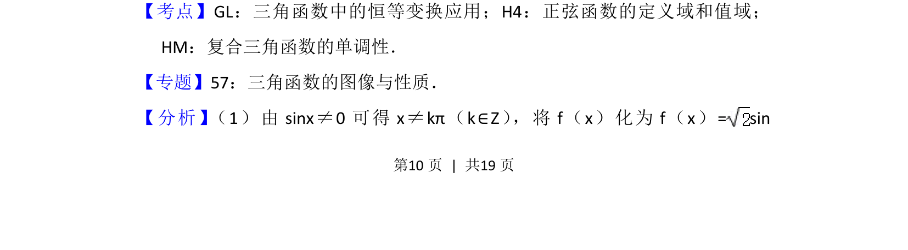
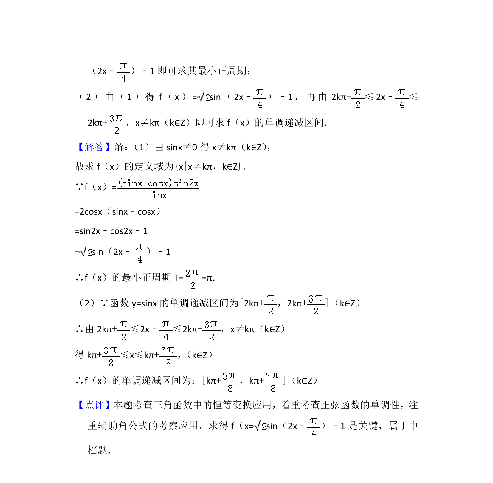

## 题面

## 摘要

求三角函数定义域、最小正周期及单调递减区间，涉及恒等变换与正弦函数性质。

## 关联考点

- [[1248-三角函数恒等变换|三角函数恒等变换]]
- [[正弦函数定义域]]
- [[复合三角函数单调性]]

## 答案与解析

> 📄 原 PDF 第 10 页：`素材/真题/北京/2008-2024·（北京）数学高考真题/2012年高考数学试卷（文）（北京）（解析卷）.pdf`

<!-- 题干文本-start -->
## 题干文本
15． （13分）已知函数f（x）=．
（1）求f（x）的定义域及最小正周期；
（2）求f（x）的单调递减区间．
<!-- 题干文本-end -->

<!-- 解析文本-start -->
## 解析文本
【考点】GL：三角函数中的恒等变换应用；H4：正弦函数的定义域和值域；
HM：复合三角函数的单调性．菁优网版权所有
【专题】57：三角函数的图像与性质．
【分析】 （1）由sinx≠0可得x≠kπ（k∈Z） ，将f（x）化为f（x）= sin
<!-- 解析文本-end -->
