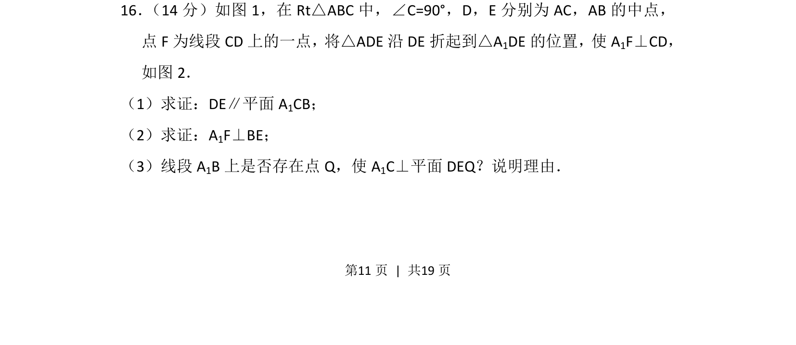
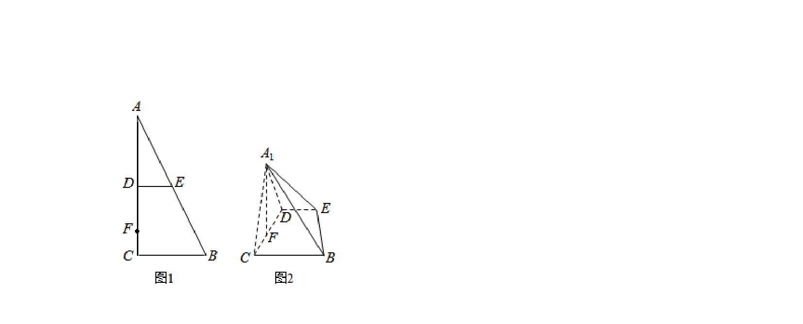
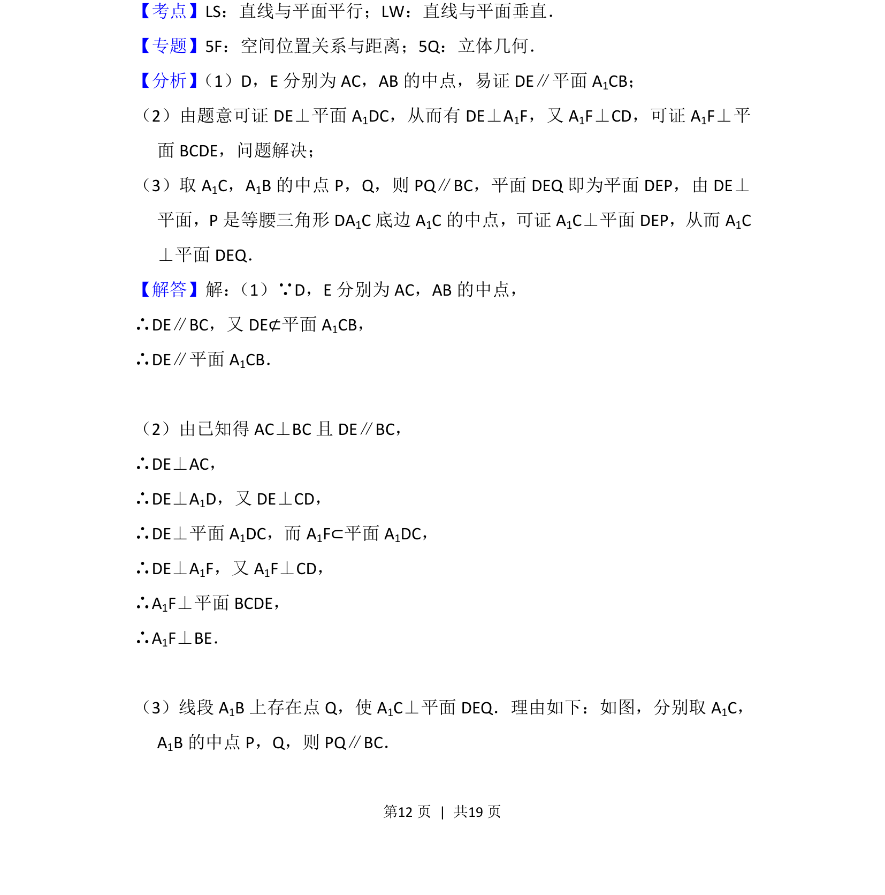
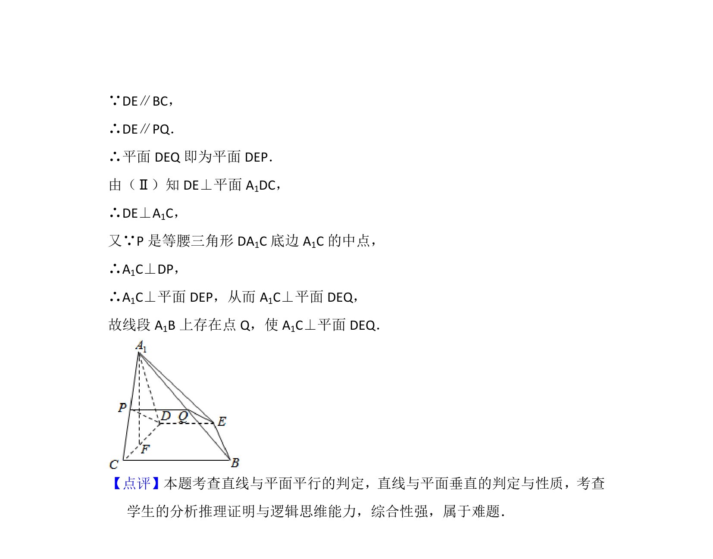

## 题面

## 摘要

立体几何折叠问题，考查线面平行、线线垂直和线面垂直的探索存在性

## 关联考点

- [[1088-线面平行判定|线面平行判定]]
- [[1083-线线垂直|线线垂直]]
- [[584-线面垂直性质|线面垂直性质]]
- [[428-存在性问题|存在性问题]]

## 答案与解析

> 📄 原 PDF 第 11 页：`素材/真题/北京/2008-2024·（北京）数学高考真题/2012年高考数学试卷（文）（北京）（解析卷）.pdf`
