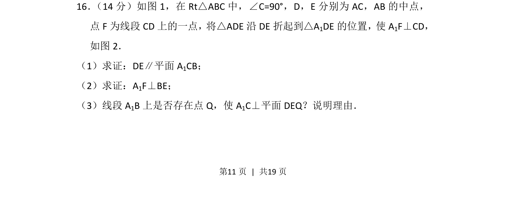
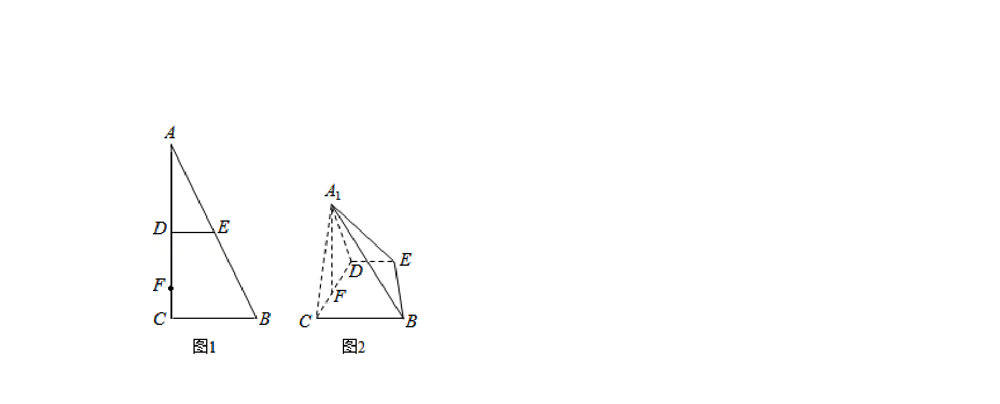
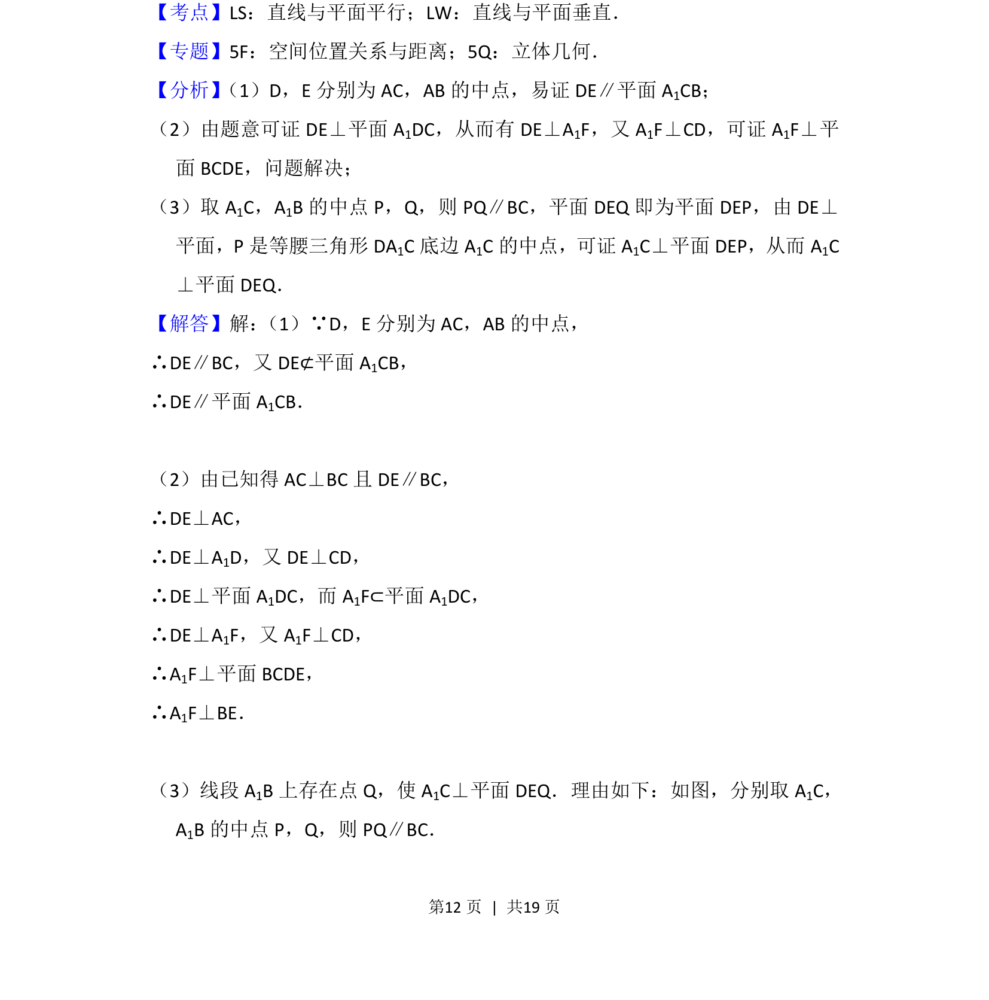
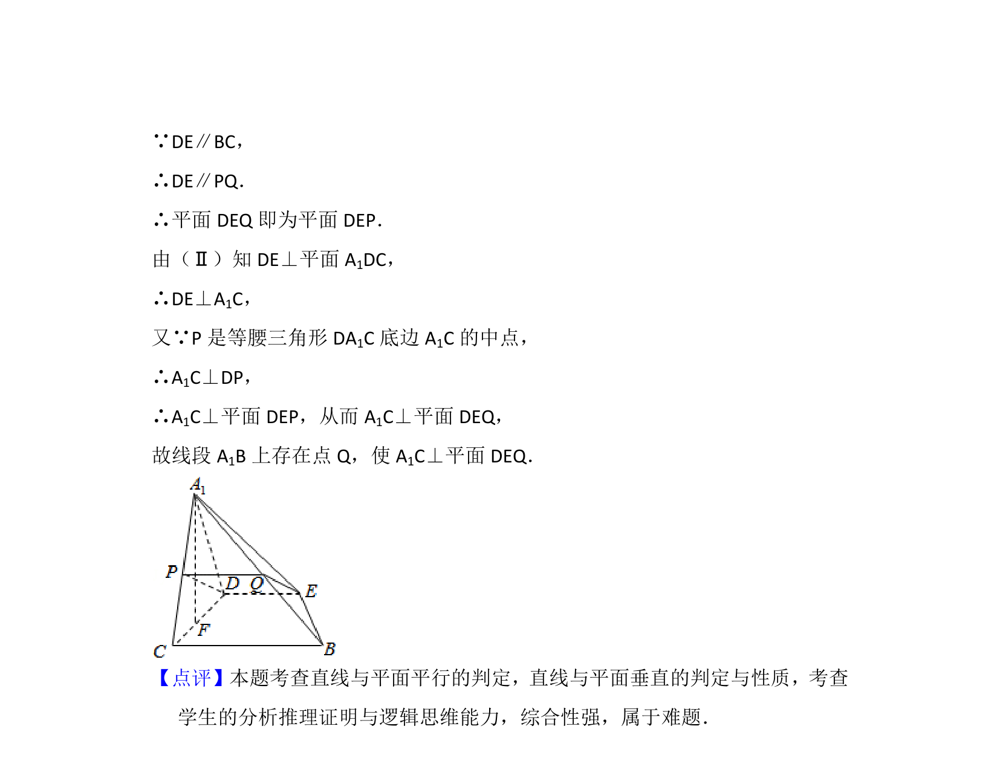

## 题面

## 摘要

立体几何折叠问题，考查线面平行、线线垂直和线面垂直的探索存在性

## 关联考点

- [[1400-线面平行的判定|线面平行判定]]
- [[1083-线线垂直|线线垂直]]
- [[584-线面垂直性质|线面垂直性质]]
- [[428-存在性问题|存在性问题]]

## 答案与解析

> 📄 原 PDF 第 11 页：`素材/真题/北京/2008-2024·（北京）数学高考真题/2012年高考数学试卷（文）（北京）（解析卷）.pdf`

<!-- 题干文本-start -->
## 题干文本
16． （14分）如图1，在Rt△ABC中，∠C=90°，D，E分别为AC，AB的中点，
点F为线段CD上的一点，将△ADE沿DE折起到△A 1DE的位置，使A 1F⊥CD，
如图2．
（1）求证：DE∥平面A 1CB；
（2）求证：A1F⊥BE；
（3）线段A 1B上是否存在点Q，使A 1C⊥平面DEQ？说明理由．
<!-- 题干文本-end -->

<!-- 解析文本-start -->
## 解析文本

<!-- 解析文本-end -->
