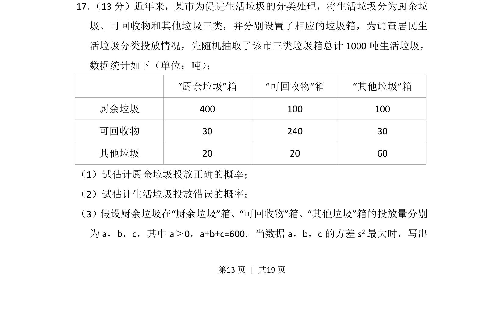
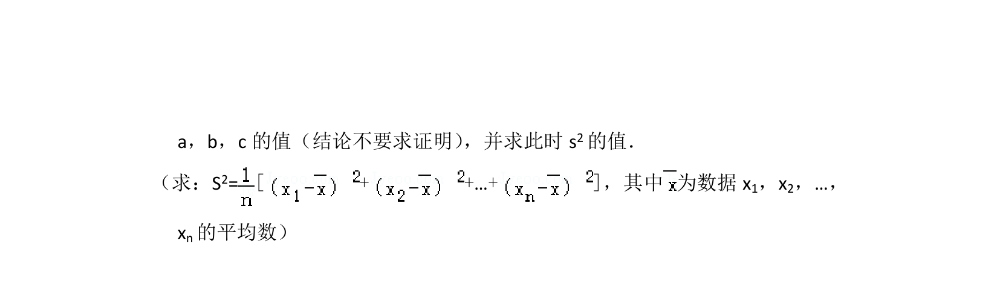
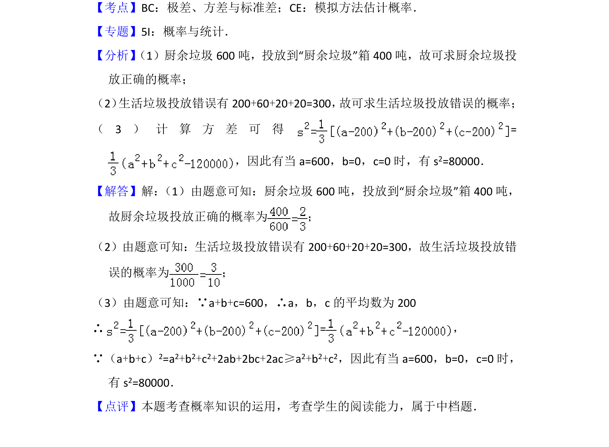

## 题面

## 摘要

该题考查通过频率估计概率及给定条件下方差最大值的应用问题。

## 关联考点

- [[1186-概率估计|概率估计]]
- [[198-方差|方差]]
- [[统计决策]]

## 答案与解析

> 📄 原 PDF 第 13 页：`素材/真题/北京/2008-2024·（北京）数学高考真题/2012年高考数学试卷（文）（北京）（解析卷）.pdf`

<!-- 题干文本-start -->
## 题干文本
17． （13分）近年来，某市为促进生活垃圾的分类处理，将生活垃圾分为厨余垃
圾、可回收物和其他垃圾三类，并分别设置了相应的垃圾箱，为调查居民生
活垃圾分类投放情况，先随机抽取了该市三类垃圾箱总计1000吨生活垃圾，
数据统计如下（单位：吨） ；
“厨余垃圾”箱 “可回收物”箱 “其他垃圾”箱
厨余垃圾 400 100 100
可回收物 30 240 30
其他垃圾 20 20 60
（1）试估计厨余垃圾投放正确的概率；
（2）试估计生活垃圾投放错误的概率；
（3）假设厨余垃圾在“厨余垃圾”箱、“可回收物”箱、“其他垃圾”箱的投放量分别
为a，b，c，其中a＞0，a+b+c=600．当数据a，b，c的方差s 2最大时，写出
<!-- 题干文本-end -->

<!-- 解析文本-start -->
## 解析文本

<!-- 解析文本-end -->
