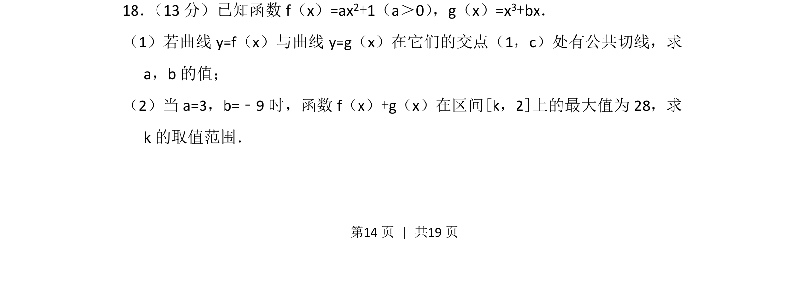
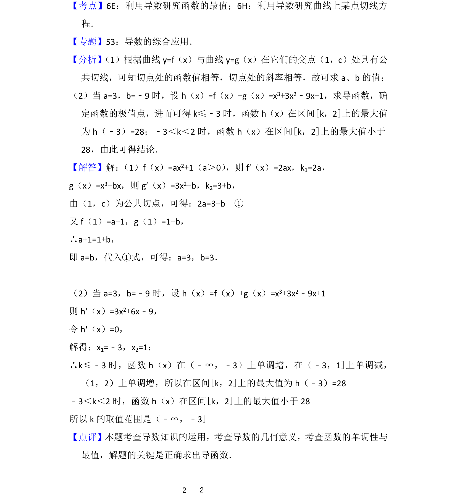

## 题面

## 摘要

考查公切线条件求参数及给定最大值求区间参数范围，涉及导数的几何意义和最值应用。

## 关联考点

- [[440-导数的几何意义|导数的几何意义]]
- [[利用导数求函数的最值]]
- [[含参数讨论]]

## 答案与解析

> 📄 原 PDF 第 14 页：`素材/真题/北京/2008-2024·（北京）数学高考真题/2012年高考数学试卷（文）（北京）（解析卷）.pdf`
