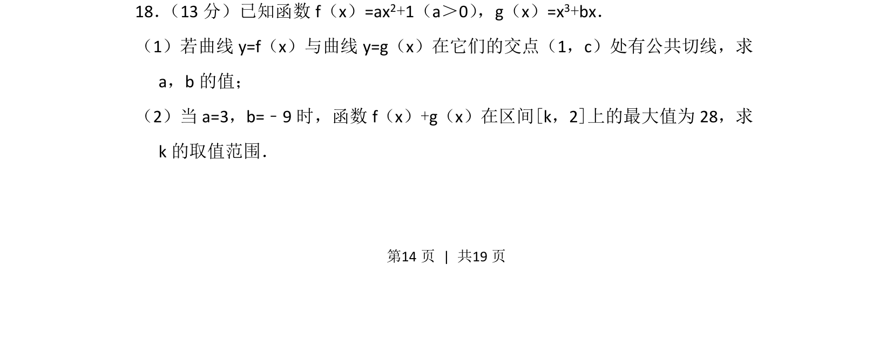
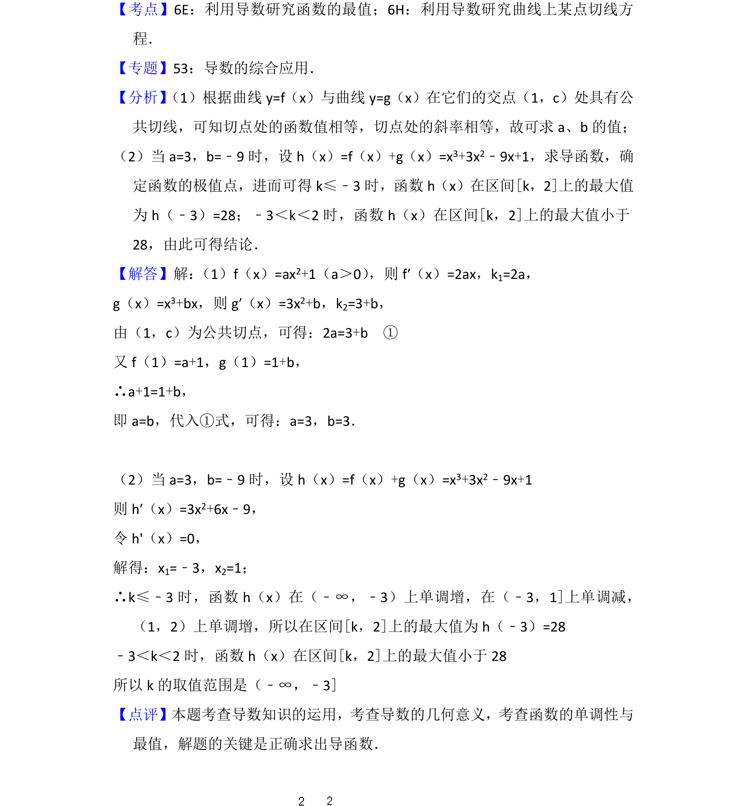

## 题面

## 摘要

考查公切线条件求参数及给定最大值求区间参数范围，涉及导数的几何意义和最值应用。

## 关联考点

- [[440-导数的几何意义|导数的几何意义]]
- [[利用导数求函数的最值]]
- [[含参数讨论]]

## 答案与解析

> 📄 原 PDF 第 14 页：`素材/真题/北京/2008-2024·（北京）数学高考真题/2012年高考数学试卷（文）（北京）（解析卷）.pdf`

<!-- 题干文本-start -->
## 题干文本
18． （13分）已知函数f（x）=ax2+1（a＞0） ，g（x）=x3+bx．
（1）若曲线y=f（x）与曲线y=g（x）在它们的交点（1，c）处有公共切线，求
a，b的值；
（2）当a=3，b=﹣9时，函数f（x）+g（x）在区间[k，2]上的最大值为28，求
k的取值范围．
<!-- 题干文本-end -->

<!-- 解析文本-start -->
## 解析文本

<!-- 解析文本-end -->
