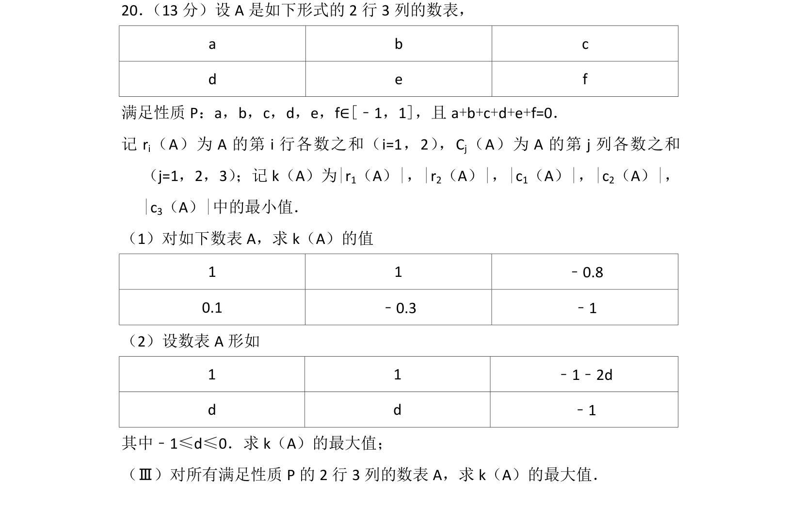
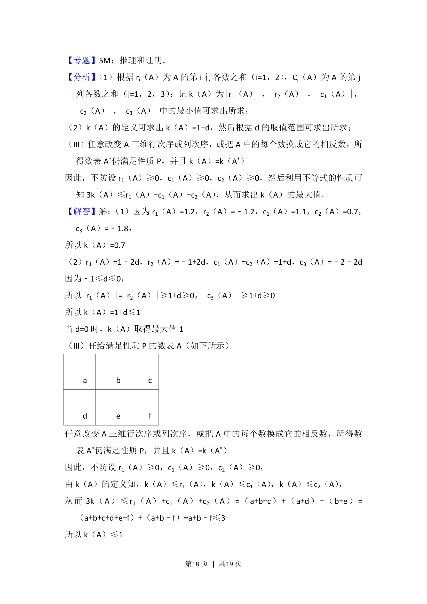
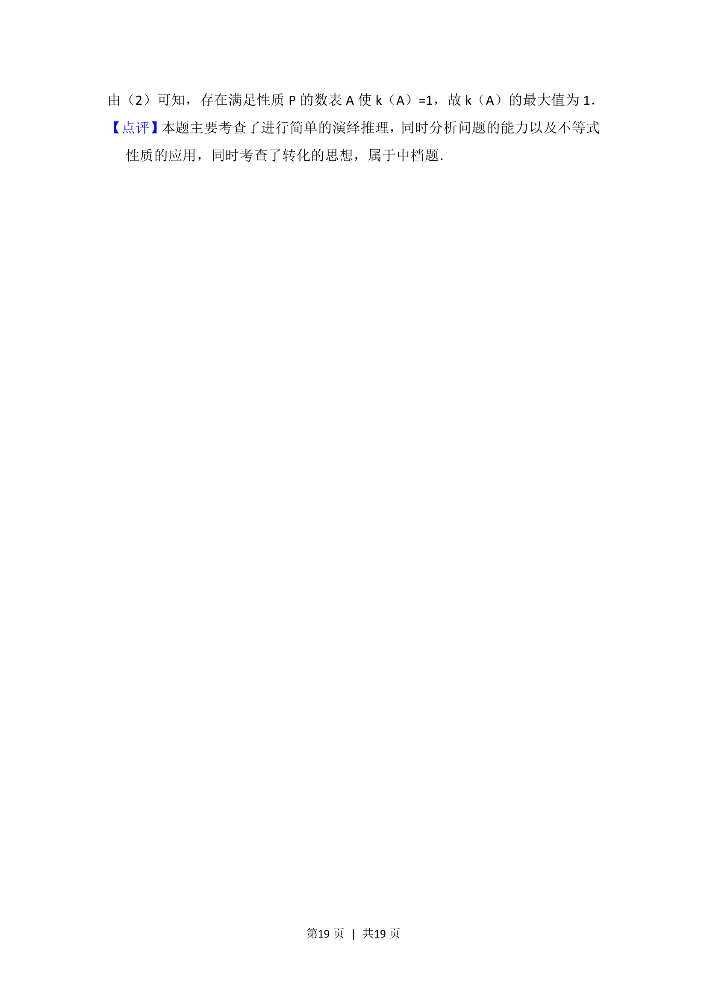

## 题面

## 摘要

给定约束矩阵，求行和列和的绝对值最小值的最优值问题包含计算与参数优化

## 关联考点

- [[矩阵行和与列和]]
- [[绝对值最小值优化]]
- [[037-推理|演绎推理]]

## 答案与解析

> 📄 原 PDF 第 17 页：`素材/真题/北京/2008-2024·（北京）数学高考真题/2012年高考数学试卷（文）（北京）（解析卷）.pdf`

<!-- 题干文本-start -->
## 题干文本
20． （13分）设A是如下形式的2行3列的数表，
a b c
d e f
满足性质P：a，b，c，d，e，f∈[﹣1，1]，且a+b+c+d+e+f=0．
记r i（A）为A的第i行各数之和（i=1，2） ，C j（A）为A的第j列各数之和
（j=1，2，3） ；记k（A）为|r1（A）|，|r2（A）|，|c1（A）|，|c2（A）|，
|c3（A）|中的最小值．
（1）对如下数表A，求k（A）的值
1 1 ﹣0.8
0.1 ﹣0.3 ﹣1
（2）设数表A形如
1 1 ﹣1﹣2d
d d ﹣1
其中﹣1≤d≤0．求k（A）的最大值；
（Ⅲ）对所有满足性质P的2行3列的数表A，求k（A）的最大值．
<!-- 题干文本-end -->

<!-- 解析文本-start -->
## 解析文本
【考点】F5：演绎推理．菁优网版权所有
<!-- 解析文本-end -->
