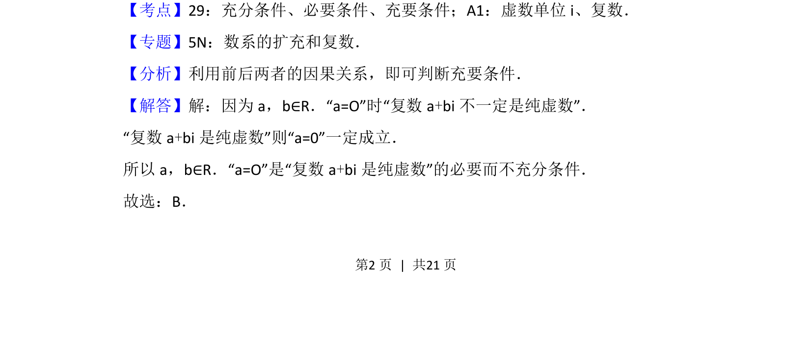
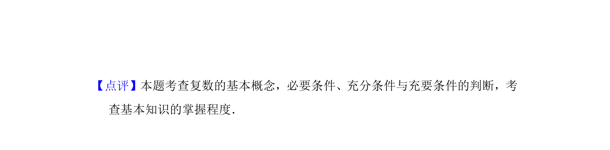

## 题面

## 摘要

判断a=0与复数a+bi为纯虚数的条件关系

## 关联考点

- [[533-充分必要条件|充分条件与必要条件]]
- [[纯虚数]]

## 答案与解析

> 📄 原 PDF 第 2 页：`素材/真题/北京/2008-2024·（北京）数学高考真题/2012年高考数学试卷（理）（北京）（解析卷）.pdf`

<!-- 题干文本-start -->
## 题干文本
3． （5分）设a，b∈R．“a=0”是“复数a+bi是纯虚数”的（　　）
A．充分而不必要条件B．必要而不充分条件
C．充分必要条件D．既不充分也不必要条件
<!-- 题干文本-end -->

<!-- 解析文本-start -->
## 解析文本
【考点】29：充分条件、必要条件、充要条件；A1：虚数单位i、复数．菁优网版权所有
【专题】5N：数系的扩充和复数．
【分析】利用前后两者的因果关系，即可判断充要条件．
【解答】解：因为a，b∈R．“a=O”时“复数a+bi不一定是纯虚数”．
“复数a+bi是纯虚数”则“a=0”一定成立．
所以a，b∈R．“a=O”是“复数a+bi是纯虚数”的必要而不充分条件．
故选：B．
<!-- 解析文本-end -->
