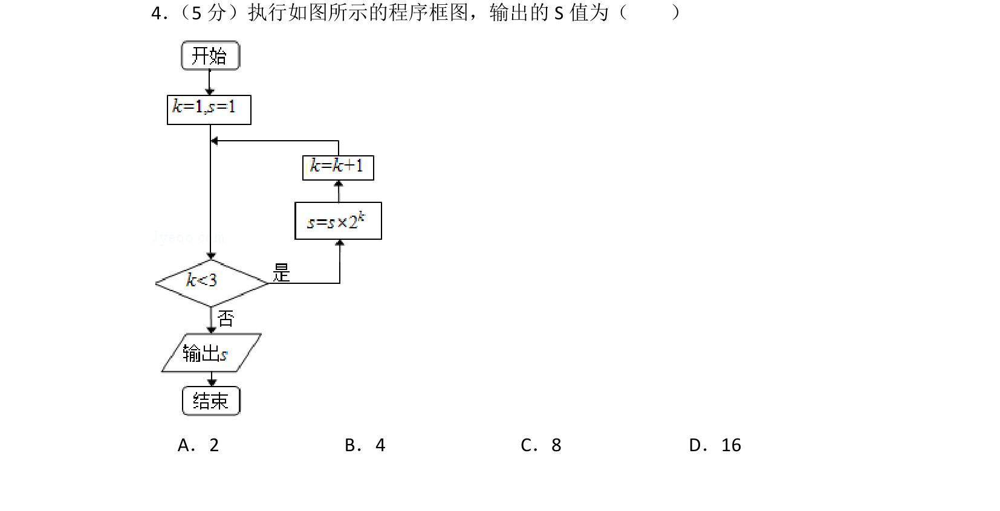
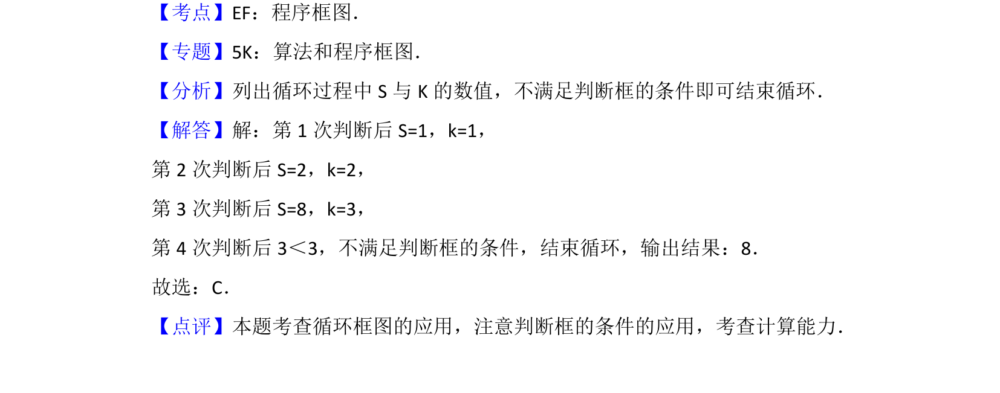

## 题面

## 摘要

执行程序框图，通过循环结构计算输出S值。

## 关联考点

- [[1042-程序框图|程序框图]]
- [[870-循环结构|循环结构]]

## 答案与解析

> 📄 原 PDF 第 3 页：`素材/真题/北京/2008-2024·（北京）数学高考真题/2012年高考数学试卷（理）（北京）（解析卷）.pdf`

<!-- 题干文本-start -->
## 题干文本
4． （5分）执行如图所示的程序框图，输出的S值为（　　）
A．2 B．4 C．8 D．16
<!-- 题干文本-end -->

<!-- 解析文本-start -->
## 解析文本
【考点】EF：程序框图．菁优网版权所有
【专题】5K：算法和程序框图．
【分析】列出循环过程中S与K的数值，不满足判断框的条件即可结束循环．
【解答】解：第1次判断后S=1，k=1，
第2次判断后S=2，k=2，
第3次判断后S=8，k=3，
第4次判断后3＜3，不满足判断框的条件，结束循环，输出结果：8．
故选：C．
【点评】本题考查循环框图的应用，注意判断框的条件的应用，考查计算能力．
<!-- 解析文本-end -->
