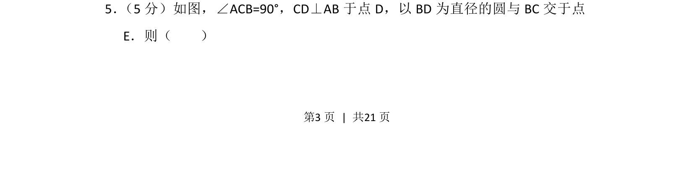
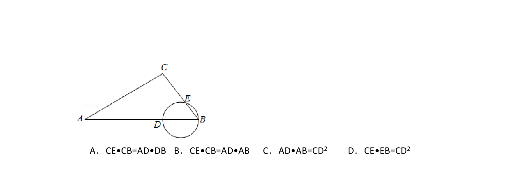
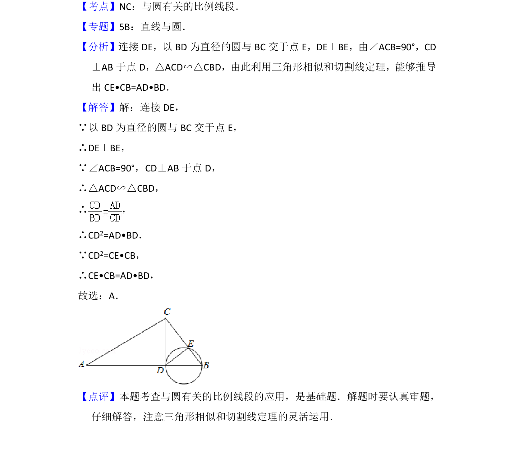

## 题面

## 摘要

在直角三角形中作高线，以垂足为直径的圆与直角边相交，考查几何元素间的关系。

## 关联考点

- [[221-圆周角定理|圆周角定理]]
- [[1033-相似三角形|相似三角形]]
- [[直角三角形性质]]

## 答案与解析

> 📄 原 PDF 第 3 页：`素材/真题/北京/2008-2024·（北京）数学高考真题/2012年高考数学试卷（理）（北京）（解析卷）.pdf`
