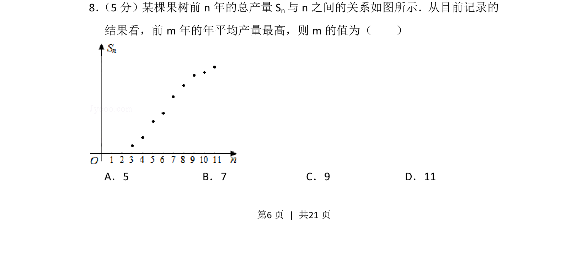
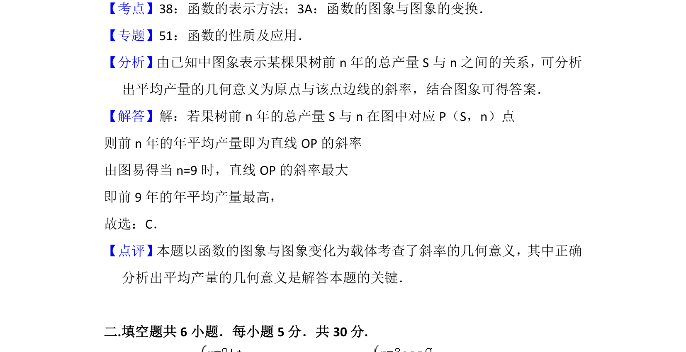

## 题面

## 摘要

根据前n年总产量图像，求年平均产量（即点(n, S_n)与原点连线的斜率）最大时对应的n值。

## 关联考点

- [[函数图像分析]]
- [[449-平均变化率|平均变化率]]
- [[913-最值问题|最值问题]]

## 答案与解析

> 📄 原 PDF 第 6 页：`素材/真题/北京/2008-2024·（北京）数学高考真题/2012年高考数学试卷（理）（北京）（解析卷）.pdf`
