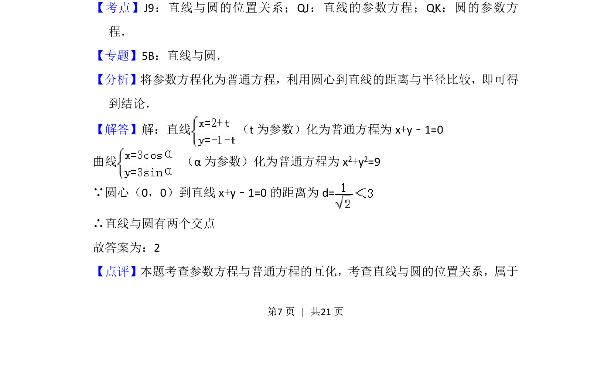

## 题面

## 摘要

本题考查将参数方程化为普通方程，并通过直线与圆的位置关系判断交点个数。

## 关联考点

- [[394-直线和圆位置关系-高中|直线与圆的位置关系]]
- [[直线的参数方程]]
- [[544-圆的参数方程|圆的参数方程]]

## 答案与解析

> 📄 原 PDF 第 7 页：`素材/真题/北京/2008-2024·（北京）数学高考真题/2012年高考数学试卷（理）（北京）（解析卷）.pdf`
