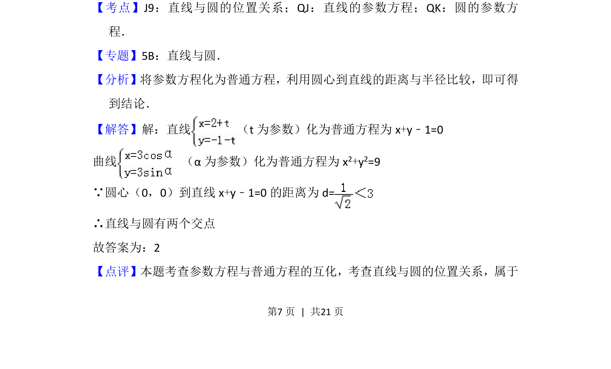

## 题面

## 摘要

本题考查将参数方程化为普通方程，并通过直线与圆的位置关系判断交点个数。

## 关联考点

- [[394-直线和圆位置关系-高中|直线与圆的位置关系]]
- [[直线的参数方程]]
- [[544-圆的参数方程|圆的参数方程]]

## 答案与解析

> 📄 原 PDF 第 7 页：`素材/真题/北京/2008-2024·（北京）数学高考真题/2012年高考数学试卷（理）（北京）（解析卷）.pdf`

<!-- 题干文本-start -->
## 题干文本
9． （5分）直线 （t为参数）与曲线 （α为参数）的交点个
数为　2　．
<!-- 题干文本-end -->

<!-- 解析文本-start -->
## 解析文本
【考点】J9：直线与圆的位置关系；QJ：直线的参数方程；QK：圆的参数方
程．菁优网版权所有
【专题】5B：直线与圆．
【分析】将参数方程化为普通方程，利用圆心到直线的距离与半径比较，即可得
到结论．
【解答】解：直线 （t为参数）化为普通方程为x+y﹣1=0
曲线 （α为参数）化为普通方程为x 2+y2=9
∵圆心（0，0）到直线x+y﹣1=0的距离为d=
∴直线与圆有两个交点
故答案为：2
【点评】本题考查参数方程与普通方程的互化，考查直线与圆的位置关系，属于
<!-- 解析文本-end -->
