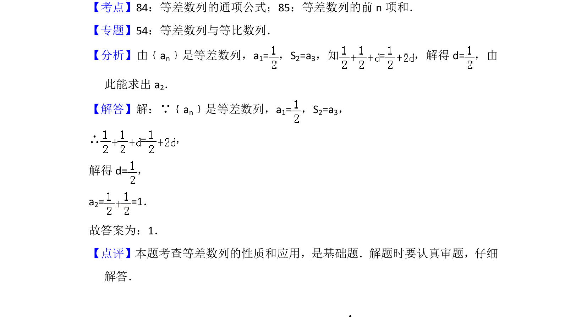

## 题面

## 摘要

已知等差数列的首项和前两项和与第三项的关系，求第二项的值。

## 关联考点

- [[1062-等差数列的通项公式|等差数列的通项公式]]
- [[1060-等差数列的前n项和|等差数列的前n项和]]

## 答案与解析

> 📄 原 PDF 第 8 页：`素材/真题/北京/2008-2024·（北京）数学高考真题/2012年高考数学试卷（理）（北京）（解析卷）.pdf`
