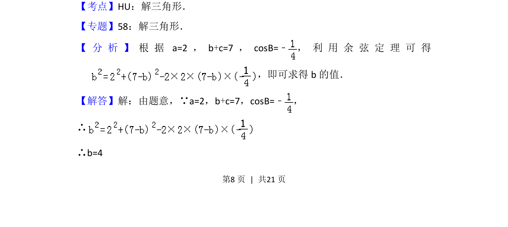
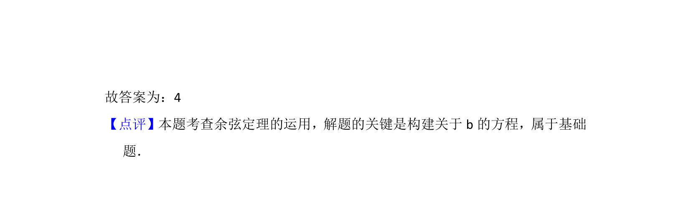

## 题面

## 摘要

在△ABC中已知两边关系及一角余弦，利用余弦定理求边长

## 关联考点

- [[126-定理|余弦定理]]
- [[589-解三角形|解三角形]]

## 答案与解析

> 📄 原 PDF 第 8 页：`素材/真题/北京/2008-2024·（北京）数学高考真题/2012年高考数学试卷（理）（北京）（解析卷）.pdf`

<!-- 题干文本-start -->
## 题干文本
11． （5分）在△ABC中，若a=2，b+c=7，cosB=﹣，则b=　4　．
<!-- 题干文本-end -->

<!-- 解析文本-start -->
## 解析文本
【考点】HU：解三角形．菁优网版权所有
【专题】58：解三角形．
【 分 析 】 根 据a=2，b+c=7，cosB=﹣， 利 用 余 弦 定 理 可 得
，即可求得b的值．
【解答】解：由题意，∵a=2，b+c=7，cosB=﹣，
∴
∴b=4
<!-- 解析文本-end -->
