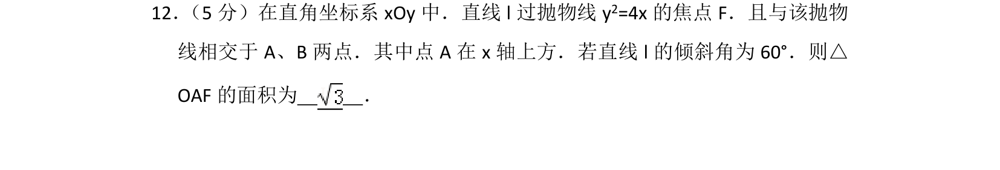
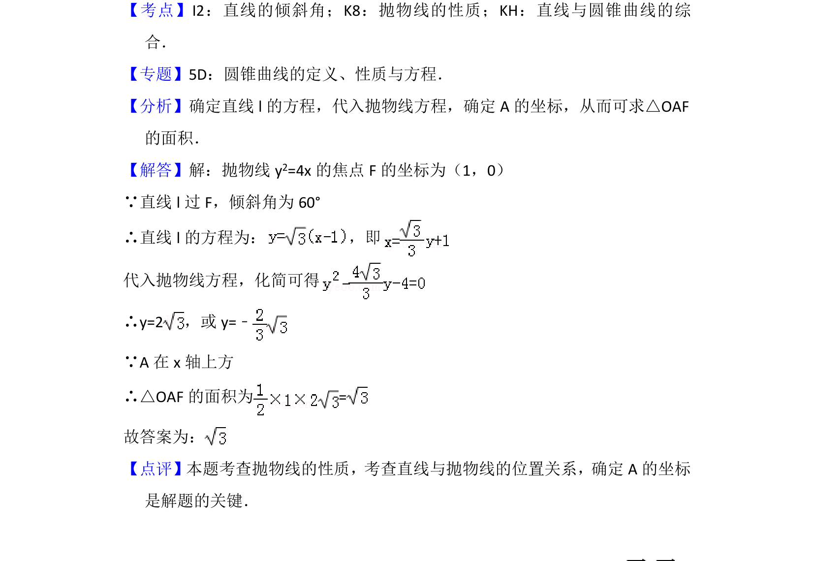

## 题面

## 摘要

求抛物线焦点弦相关问题，通过直线方程联立抛物线求交点坐标，计算三角形面积。

## 关联考点

- [[880-抛物线的性质|抛物线的性质]]
- [[1008-直线与圆锥曲线的综合|直线与圆锥曲线的综合]]
- [[直线的倾斜角]]

## 答案与解析

> 📄 原 PDF 第 9 页：`素材/真题/北京/2008-2024·（北京）数学高考真题/2012年高考数学试卷（理）（北京）（解析卷）.pdf`
