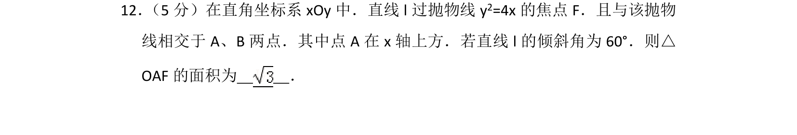
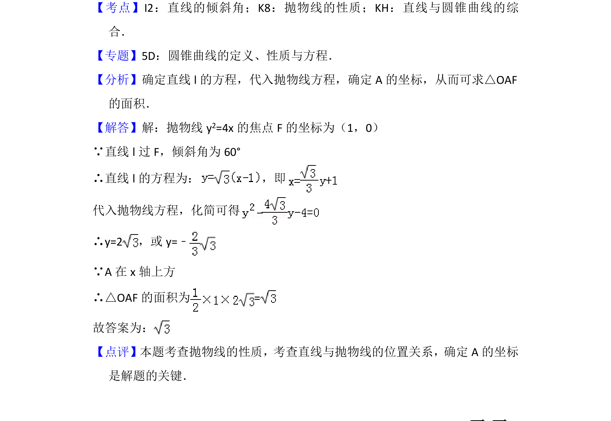

## 题面

## 摘要

求抛物线焦点弦相关问题，通过直线方程联立抛物线求交点坐标，计算三角形面积。

## 关联考点

- [[879-抛物线的性质|抛物线的性质]]
- [[1007-直线与圆锥曲线的综合|直线与圆锥曲线的综合]]
- [[直线的倾斜角]]

## 答案与解析

> 📄 原 PDF 第 9 页：`素材/真题/北京/2008-2024·（北京）数学高考真题/2012年高考数学试卷（理）（北京）（解析卷）.pdf`

<!-- 题干文本-start -->
## 题干文本
12． （5分）在直角坐标系xOy中．直线l过抛物线y 2=4x的焦点F．且与该抛物
线相交于A、B两点．其中点A在x轴上方．若直线l的倾斜角为60°．则△
OAF的面积为　 　．
<!-- 题干文本-end -->

<!-- 解析文本-start -->
## 解析文本
【考点】I2：直线的倾斜角；K8：抛物线的性质；KH：直线与圆锥曲线的综
合．菁优网版权所有
【专题】5D：圆锥曲线的定义、性质与方程．
【分析】确定直线l的方程，代入抛物线方程，确定A的坐标，从而可求△OAF
的面积．
【解答】解：抛物线y 2=4x的焦点F的坐标为（1，0）
∵直线l过F，倾斜角为60°
∴直线l的方程为： ，即
代入抛物线方程，化简可得
∴y=2，或y=﹣
∵A在x轴上方
∴△OAF的面积为=
故答案为：
【点评】本题考查抛物线的性质，考查直线与抛物线的位置关系，确定A的坐标
是解题的关键．
<!-- 解析文本-end -->
