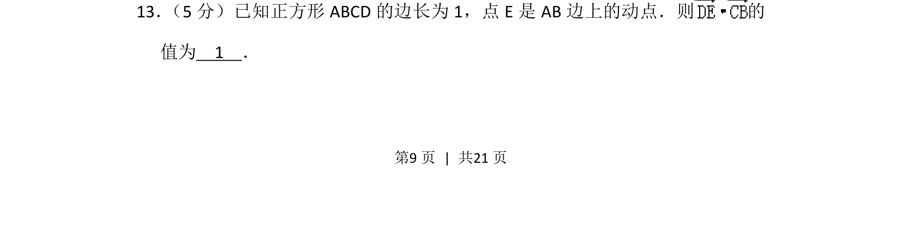
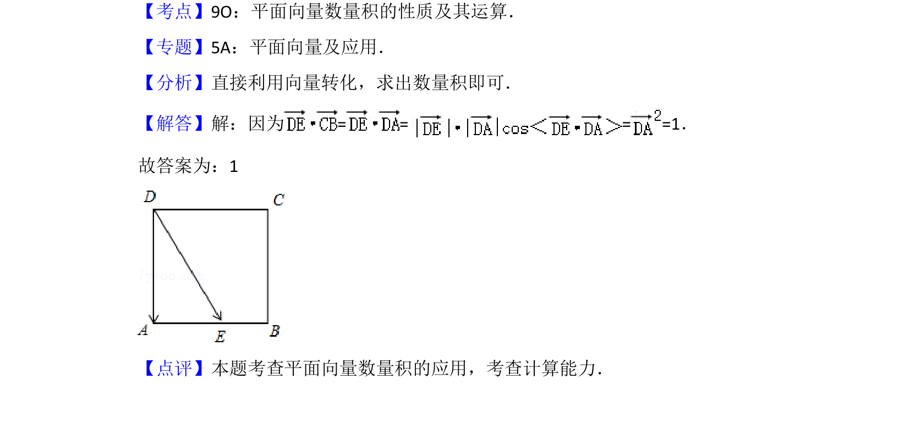

## 题面

## 摘要

正方形中动点相关的向量数量积问题，利用坐标法或基向量法求定值。

## 关联考点

- [[854-平面向量数量积|平面向量数量积]]
- [[787-坐标法|坐标法]]
- [[基向量法]]

## 答案与解析

> 📄 原 PDF 第 9 页：`素材/真题/北京/2008-2024·（北京）数学高考真题/2012年高考数学试卷（理）（北京）（解析卷）.pdf`
