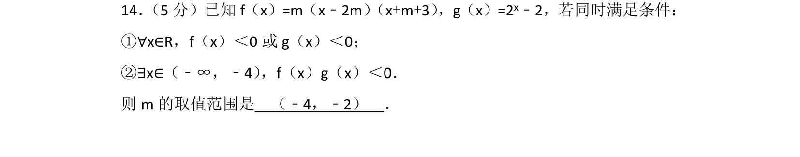
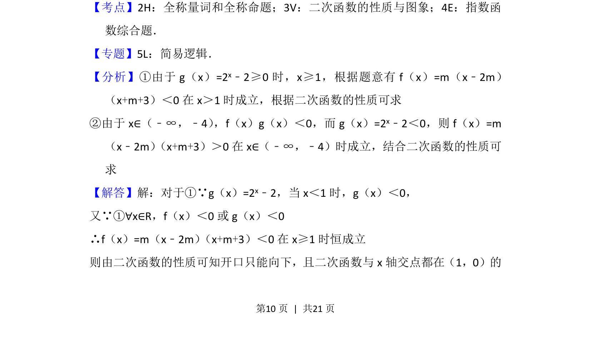
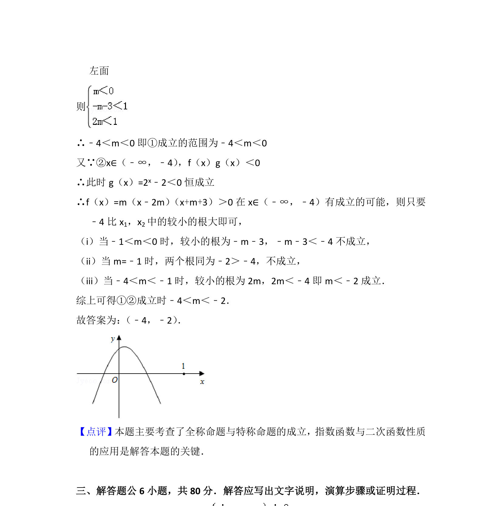

## 题面

## 摘要

已知含参二次函数与指数函数，由全称和存在条件求参数m范围，考查二次函数图象与逻辑量词综合。

## 关联考点

- [[全称量词与全称命题]]
- [[1367-二次函数的性质与图象|二次函数的性质与图象]]
- [[指数函数综合题]]

## 答案与解析

> 📄 原 PDF 第 10 页：`素材/真题/北京/2008-2024·（北京）数学高考真题/2012年高考数学试卷（理）（北京）（解析卷）.pdf`
