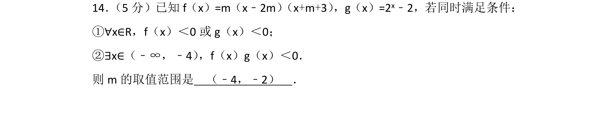
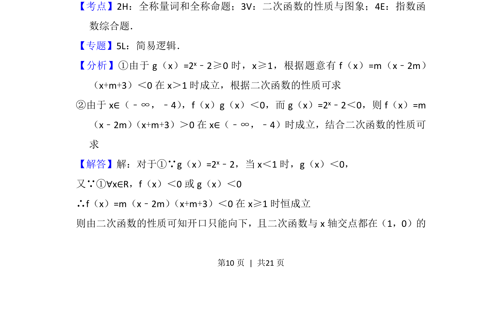
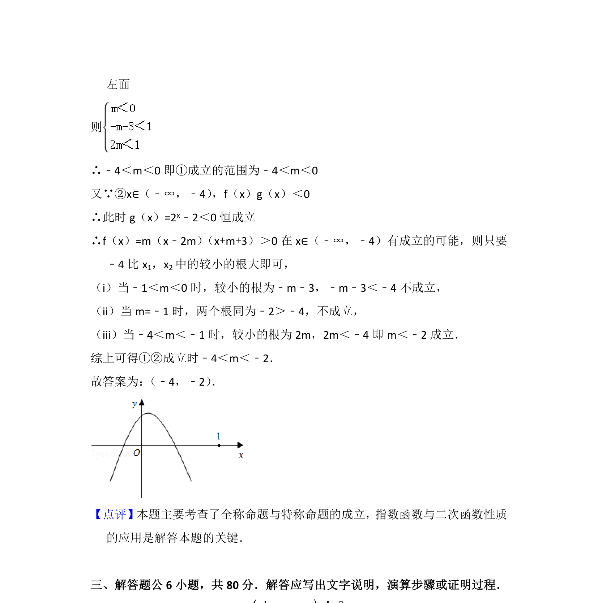

## 题面

## 摘要

已知含参二次函数与指数函数，由全称和存在条件求参数m范围，考查二次函数图象与逻辑量词综合。

## 关联考点

- [[全称量词与全称命题]]
- [[1367-二次函数的性质与图象|二次函数的性质与图象]]
- [[指数函数综合题]]

## 答案与解析

> 📄 原 PDF 第 10 页：`素材/真题/北京/2008-2024·（北京）数学高考真题/2012年高考数学试卷（理）（北京）（解析卷）.pdf`

<!-- 题干文本-start -->
## 题干文本
14． （5分）已知f（x）=m（x﹣2m） （x+m+3） ，g（x）=2x﹣2，若同时满足条件：
①∀x∈R，f（x）＜0或g（x）＜0；
②∃x∈（﹣∞，﹣4） ，f（x）g（x）＜0．
则m的取值范围是　（﹣4，﹣2）　．
<!-- 题干文本-end -->

<!-- 解析文本-start -->
## 解析文本
【考点】2H：全称量词和全称命题；3V：二次函数的性质与图象；4E：指数函
数综合题．菁优网版权所有
【专题】5L：简易逻辑．
【分析】①由于g（x）=2 x﹣2≥0时，x≥1，根据题意有f（x）=m（x﹣2m）
（x+m+3）＜0在x＞1时成立，根据二次函数的性质可求
②由于x∈（﹣∞，﹣4） ，f（x）g（x）＜0，而g（x）=2x﹣2＜0，则f（x）=m
（x﹣2m） （x+m+3）＞0在x∈（﹣∞，﹣4）时成立，结合二次函数的性质可
求
【解答】解：对于①∵g（x）=2x﹣2，当x＜1时，g（x）＜0，
又∵①∀x∈R，f（x）＜0或g（x）＜0
∴f（x）=m（x﹣2m） （x+m+3）＜0在x≥1时恒成立
则由二次函数的性质可知开口只能向下，且二次函数与x轴交点都在（1，0）的
<!-- 解析文本-end -->
