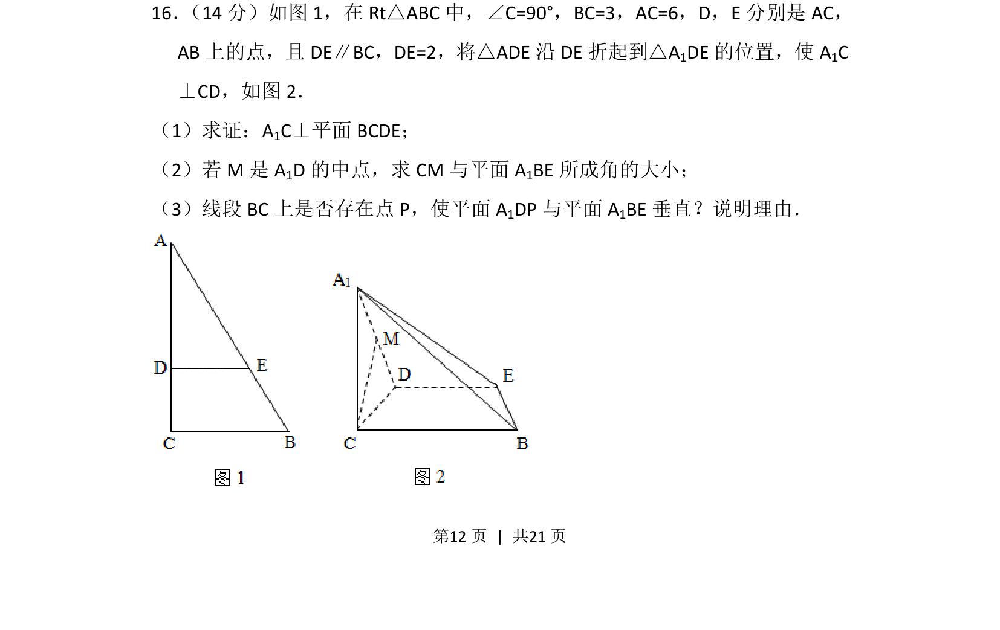
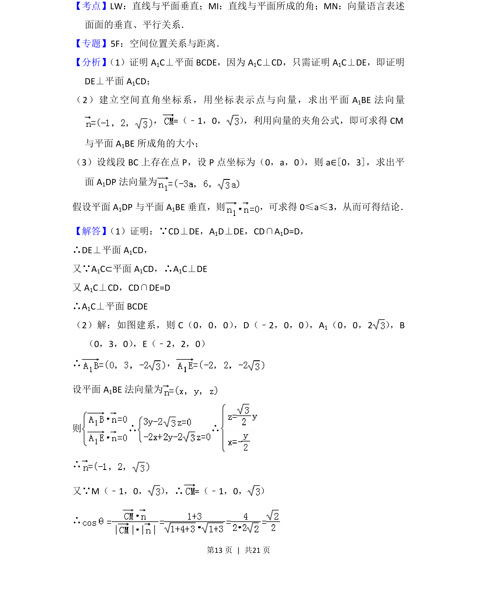
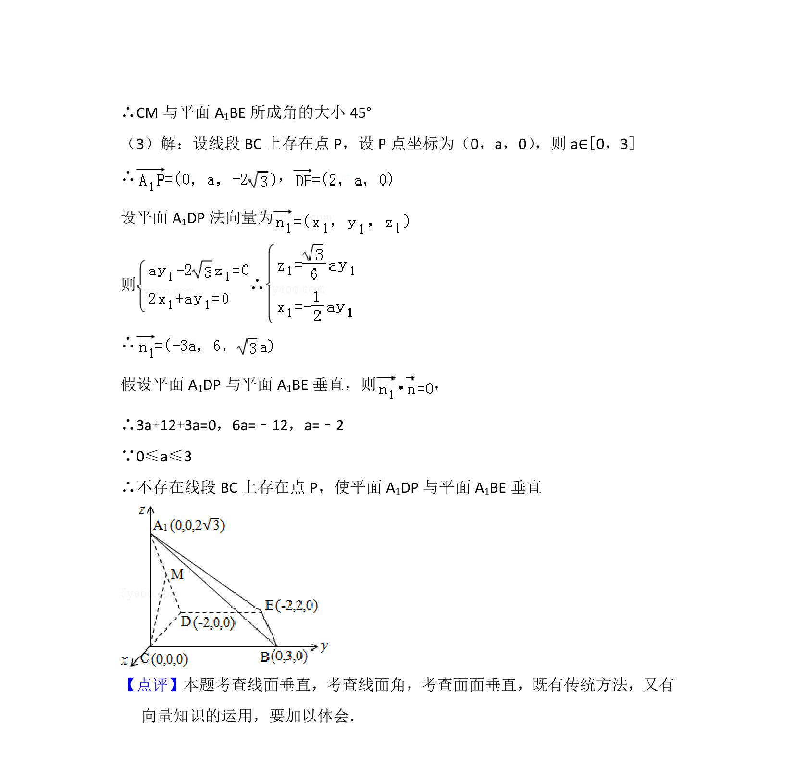

## 题面

## 摘要

折叠问题中证明线面垂直、求线面角并探究面面垂直的存在性。

## 关联考点

- [[1086-线面垂直的判定|线面垂直的判定]]
- [[1015-直线与平面所成角|直线与平面所成角]]
- [[1150-面面垂直的判定|面面垂直的判定]]
- [[579-空间向量法|空间向量法]]

## 答案与解析

> 📄 原 PDF 第 12 页：`素材/真题/北京/2008-2024·（北京）数学高考真题/2012年高考数学试卷（理）（北京）（解析卷）.pdf`
