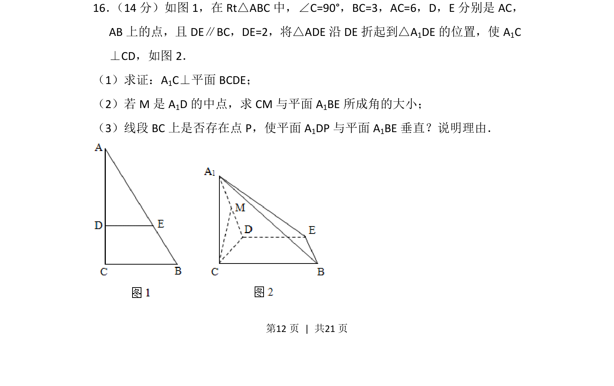
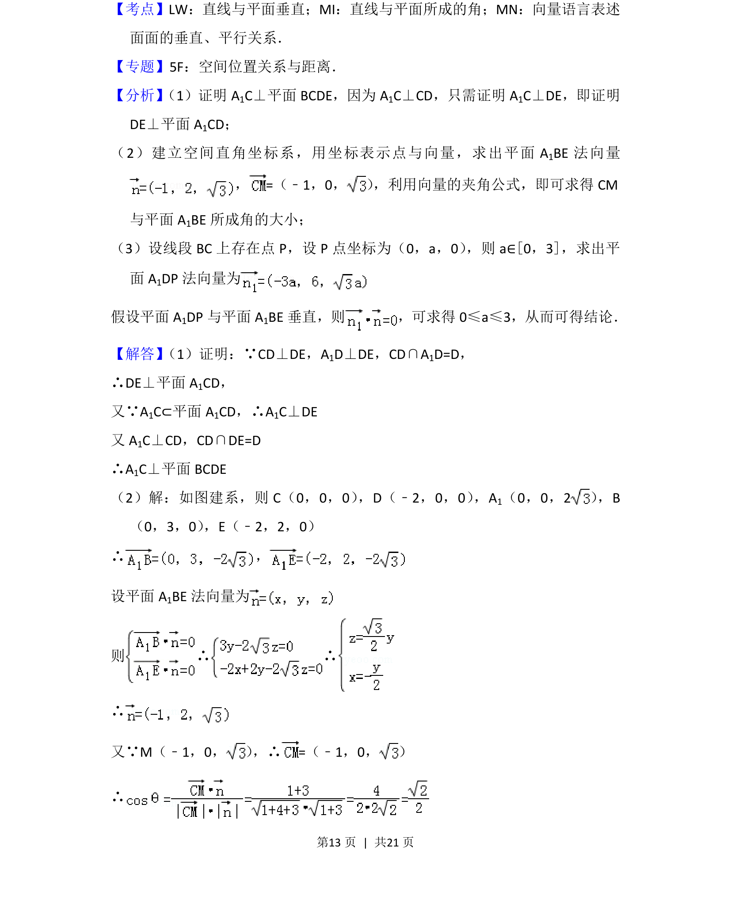
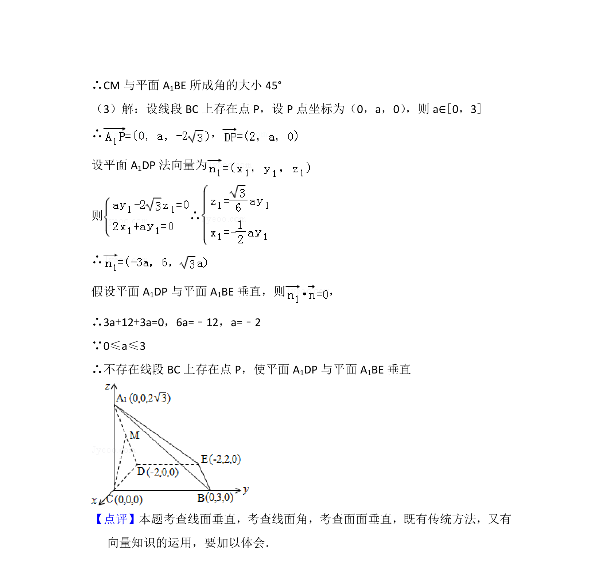

## 题面

## 摘要

折叠问题中证明线面垂直、求线面角并探究面面垂直的存在性。

## 关联考点

- [[1085-线面垂直的判定|线面垂直的判定]]
- [[1013-直线与平面所成的角|直线与平面所成角]]
- [[1149-面面垂直的判定|面面垂直的判定]]
- [[579-空间向量法|空间向量法]]

## 答案与解析

> 📄 原 PDF 第 12 页：`素材/真题/北京/2008-2024·（北京）数学高考真题/2012年高考数学试卷（理）（北京）（解析卷）.pdf`

<!-- 题干文本-start -->
## 题干文本
16． （14分）如图1，在Rt△ABC中，∠C=90°，BC=3，AC=6，D，E分别是AC，
AB上的点，且DE∥BC，DE=2，将△ADE沿DE折起到△A 1DE的位置，使A 1C
⊥CD，如图2．
（1）求证：A1C⊥平面BCDE；
（2）若M是A 1D的中点，求CM与平面A 1BE所成角的大小；
（3）线段BC上是否存在点P，使平面A 1DP与平面A 1BE垂直？说明理由．
<!-- 题干文本-end -->

<!-- 解析文本-start -->
## 解析文本

<!-- 解析文本-end -->
