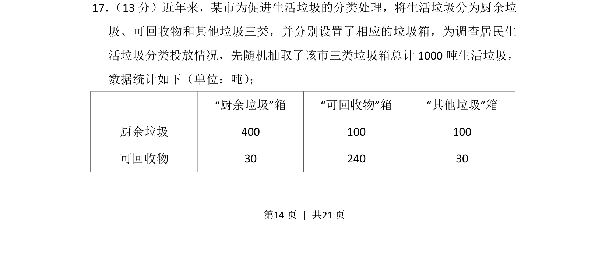
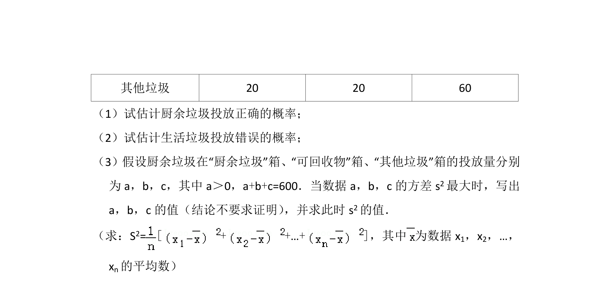
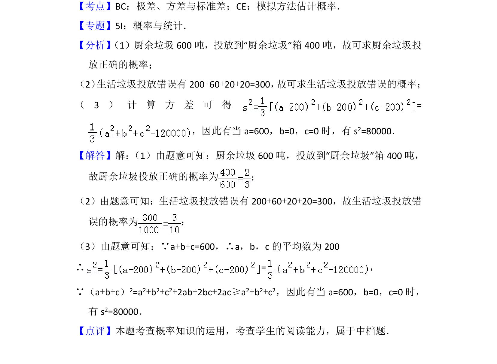

## 题面

## 摘要

该题通过统计表格呈现生活垃圾四分类投放数据，考查对分类数据的整理与分析。

## 关联考点

- [[141-统计图|统计]]
- [[分类数据]]
- [[946-概率|概率]]
- [[900-数据分析|数据分析]]

## 答案与解析

> 📄 原 PDF 第 14 页：`素材/真题/北京/2008-2024·（北京）数学高考真题/2012年高考数学试卷（理）（北京）（解析卷）.pdf`
