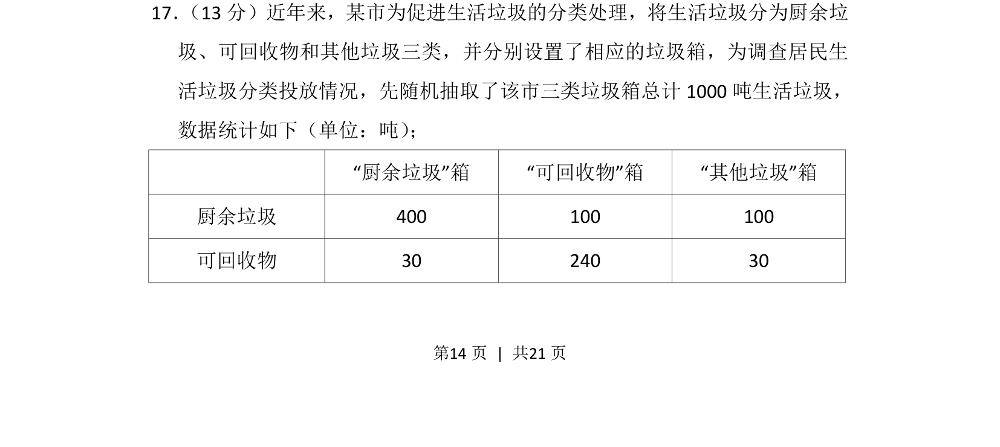
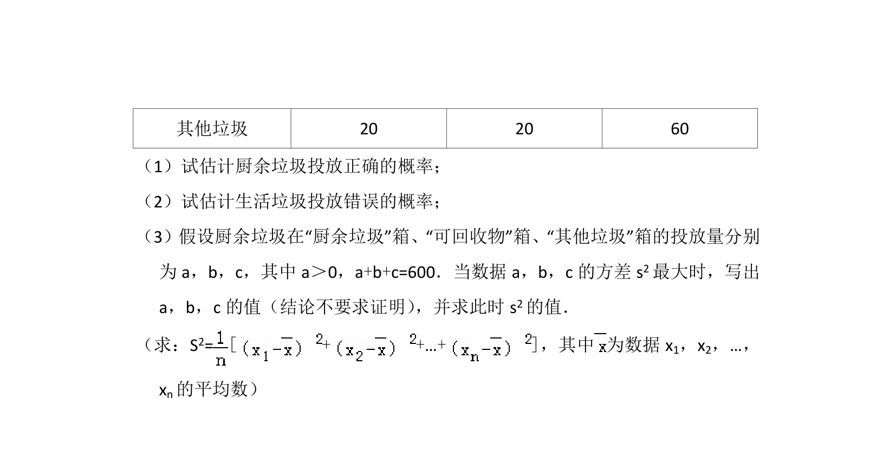
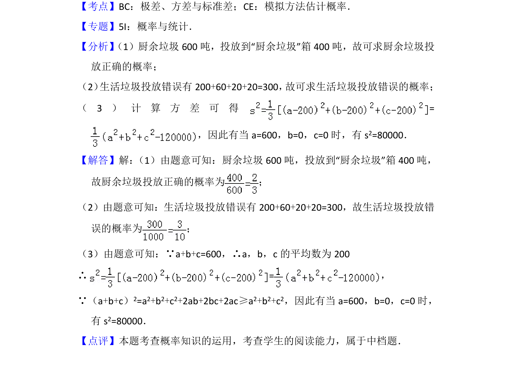

## 题面

## 摘要

该题通过统计表格呈现生活垃圾四分类投放数据，考查对分类数据的整理与分析。

## 关联考点

- [[141-统计图|统计]]
- [[分类数据]]
- [[945-概率|概率]]
- [[899-数据分析|数据分析]]

## 答案与解析

> 📄 原 PDF 第 14 页：`素材/真题/北京/2008-2024·（北京）数学高考真题/2012年高考数学试卷（理）（北京）（解析卷）.pdf`

<!-- 题干文本-start -->
## 题干文本
17． （13分）近年来，某市为促进生活垃圾的分类处理，将生活垃圾分为厨余垃
圾、可回收物和其他垃圾三类，并分别设置了相应的垃圾箱，为调查居民生
活垃圾分类投放情况，先随机抽取了该市三类垃圾箱总计1000吨生活垃圾，
数据统计如下（单位：吨） ；
“厨余垃圾”箱 “可回收物”箱 “其他垃圾”箱
厨余垃圾 400 100 100
可回收物 30 240 30
<!-- 题干文本-end -->

<!-- 解析文本-start -->
## 解析文本

<!-- 解析文本-end -->
