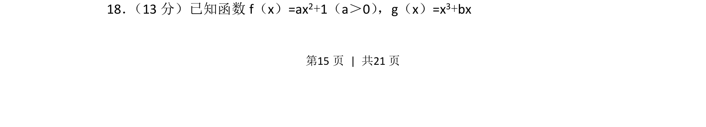
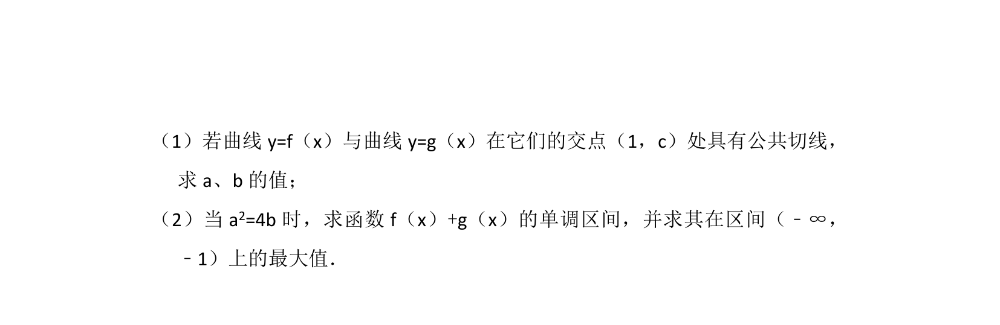
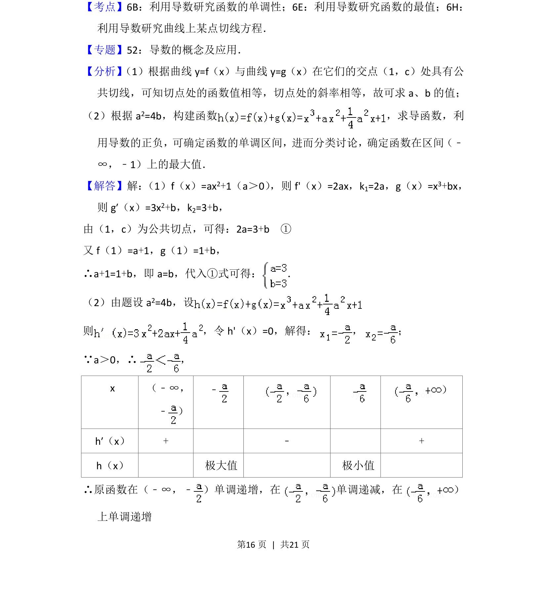
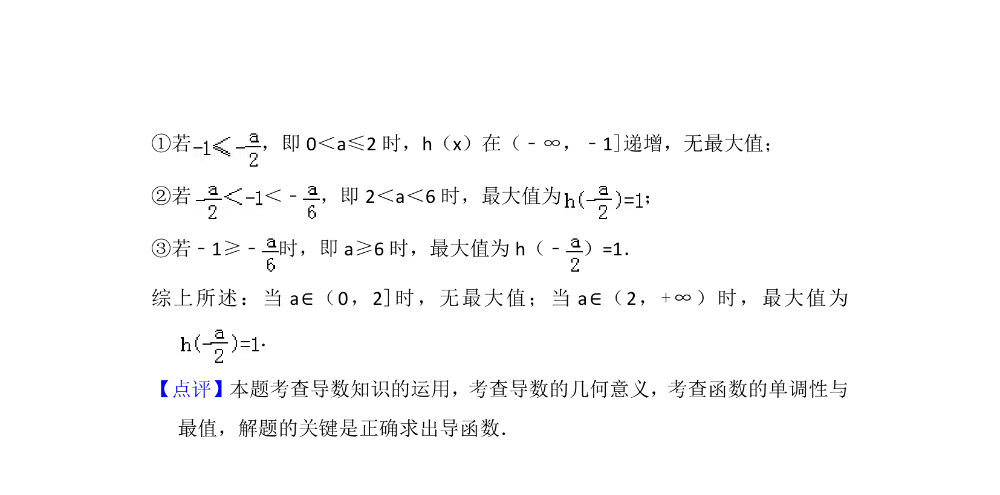

## 题面

## 摘要

已知二次函数和三次函数解析式，可能考查函数的性质或利用导数研究切线、极值等问题

## 关联考点

- [[212-二次函数定义|二次函数]]
- [[600-三次函数|三次函数]]
- [[1293-导数的应用|导数应用]]

## 答案与解析

> 📄 原 PDF 第 15 页：`素材/真题/北京/2008-2024·（北京）数学高考真题/2012年高考数学试卷（理）（北京）（解析卷）.pdf`
