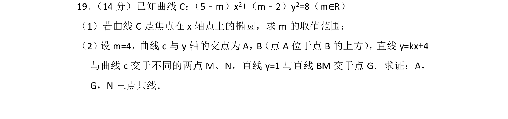
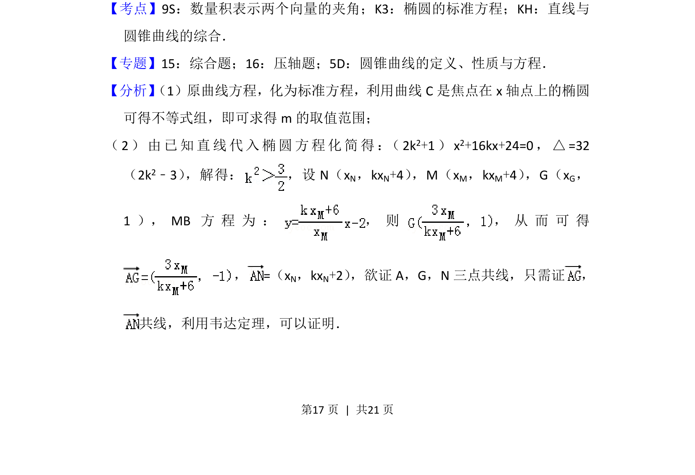
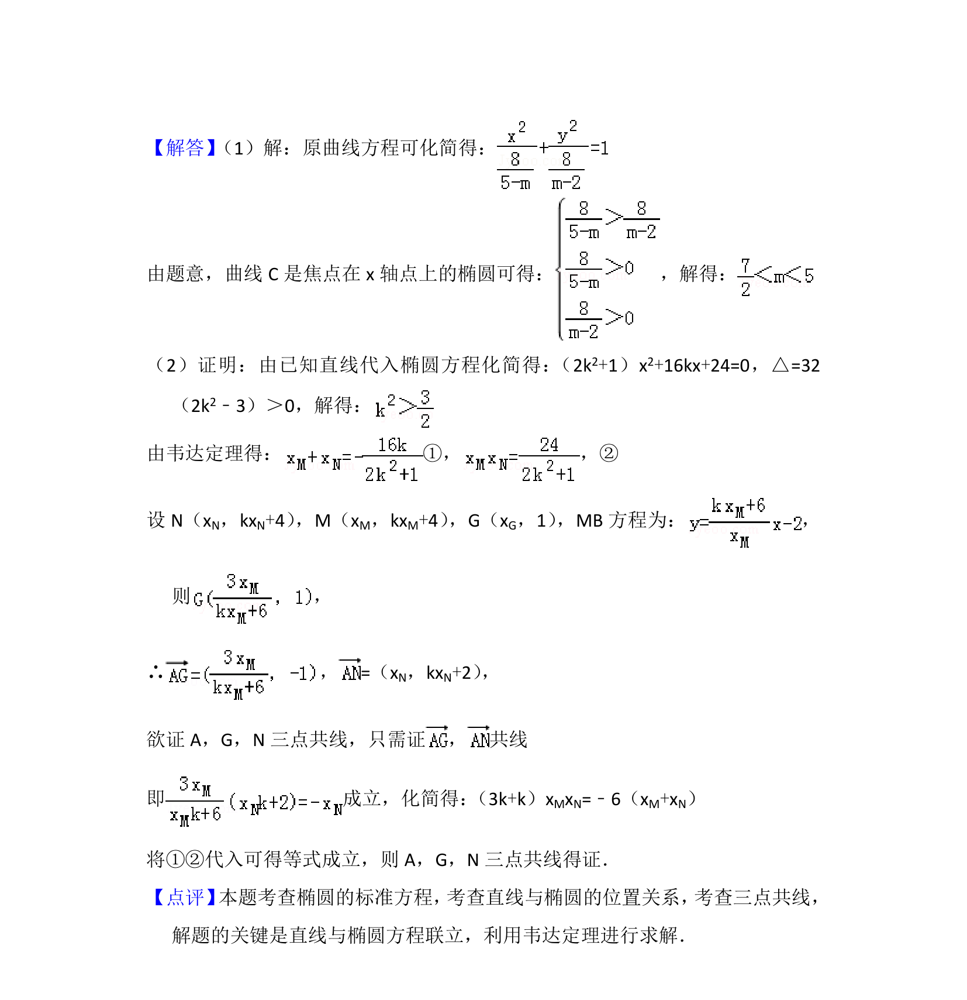

## 题面

## 摘要

已知含参数的二次曲线方程，讨论其为焦点在x轴椭圆的参数范围；给定参数后研究直线与曲线交点，并证明三点共线。

## 关联考点

- [[061-方程|椭圆的标准方程]]
- [[1007-直线与圆锥曲线的综合|直线与圆锥曲线的综合]]
- [[三点共线]]
- [[234-韦达定理-初中|韦达定理]]

## 答案与解析

> 📄 原 PDF 第 17 页：`素材/真题/北京/2008-2024·（北京）数学高考真题/2012年高考数学试卷（理）（北京）（解析卷）.pdf`
