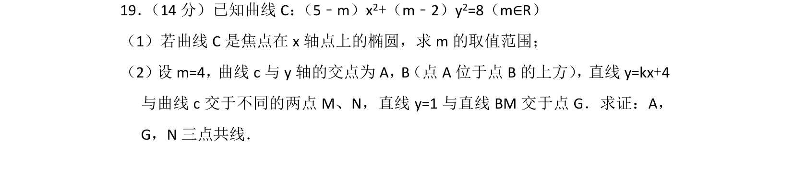
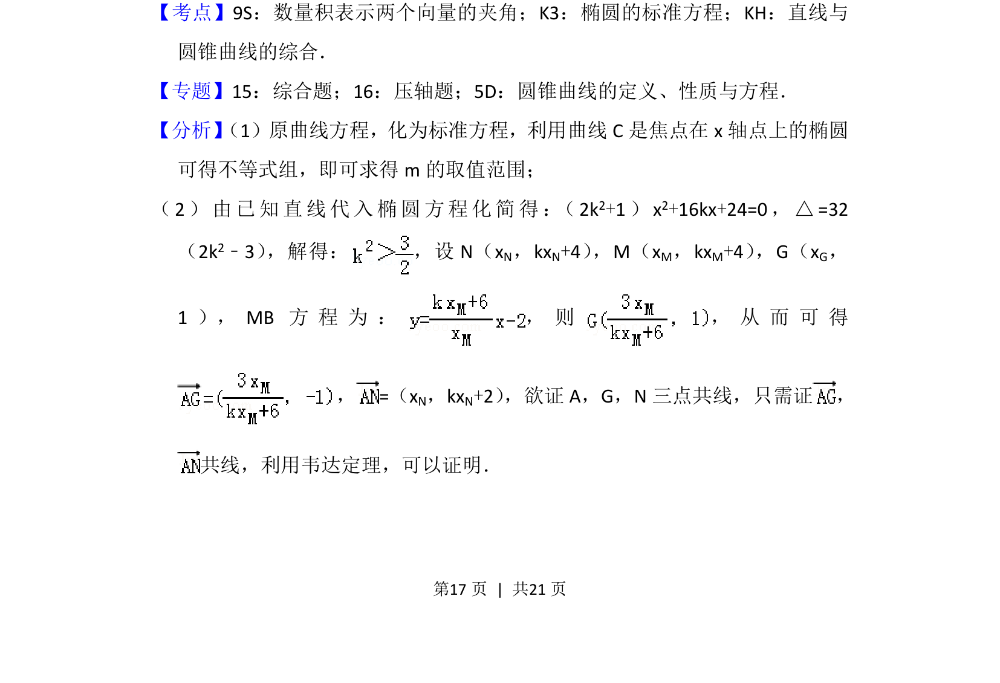
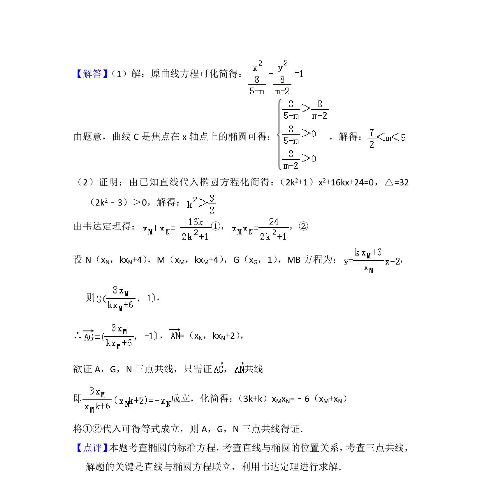

## 题面

## 摘要

已知含参数的二次曲线方程，讨论其为焦点在x轴椭圆的参数范围；给定参数后研究直线与曲线交点，并证明三点共线。

## 关联考点

- [[061-方程|椭圆的标准方程]]
- [[1007-直线与圆锥曲线的综合|直线与圆锥曲线的综合]]
- [[三点共线]]
- [[234-韦达定理-初中|韦达定理]]

## 答案与解析

> 📄 原 PDF 第 17 页：`素材/真题/北京/2008-2024·（北京）数学高考真题/2012年高考数学试卷（理）（北京）（解析卷）.pdf`

<!-- 题干文本-start -->
## 题干文本
19． （14分）已知曲线C： （5﹣m）x2+（m﹣2）y2=8（m∈R）
（1）若曲线C是焦点在x轴点上的椭圆，求m的取值范围；
（2）设m=4，曲线c与y轴的交点为A，B（点A位于点B的上方） ，直线y=kx+4
与曲线c交于不同的两点M、N，直线y=1与直线BM交于点G．求证：A，
G，N三点共线．
<!-- 题干文本-end -->

<!-- 解析文本-start -->
## 解析文本
【考点】9S：数量积表示两个向量的夹角；K3：椭圆的标准方程；KH：直线与
圆锥曲线的综合．菁优网版权所有
【专题】15：综合题；16：压轴题；5D：圆锥曲线的定义、性质与方程．
【分析】 （1）原曲线方程，化为标准方程，利用曲线C是焦点在x轴点上的椭圆
可得不等式组，即可求得m的取值范围；
（2）由已知直线代入椭圆方程化简得： （2k 2+1）x 2+16kx+24=0，△=32
（2k2﹣3） ，解得： ，设N（x N，kxN+4） ，M（xM，kxM+4） ，G（xG，
1），MB方 程 为 ： ， 则 ， 从 而 可 得
，=（x N，kxN+2） ，欲证A，G，N三点共线，只需证 ，
共线，利用韦达定理，可以证明．
<!-- 解析文本-end -->
