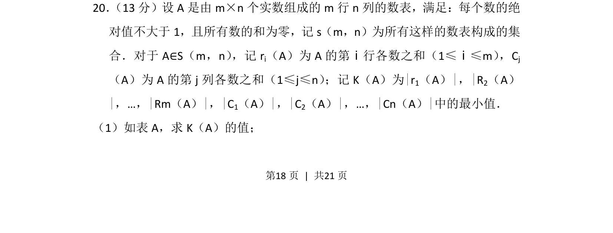
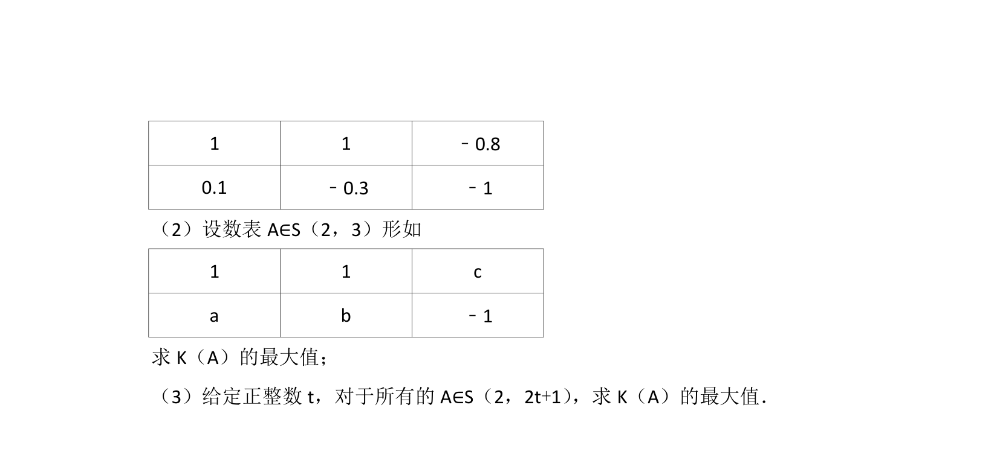
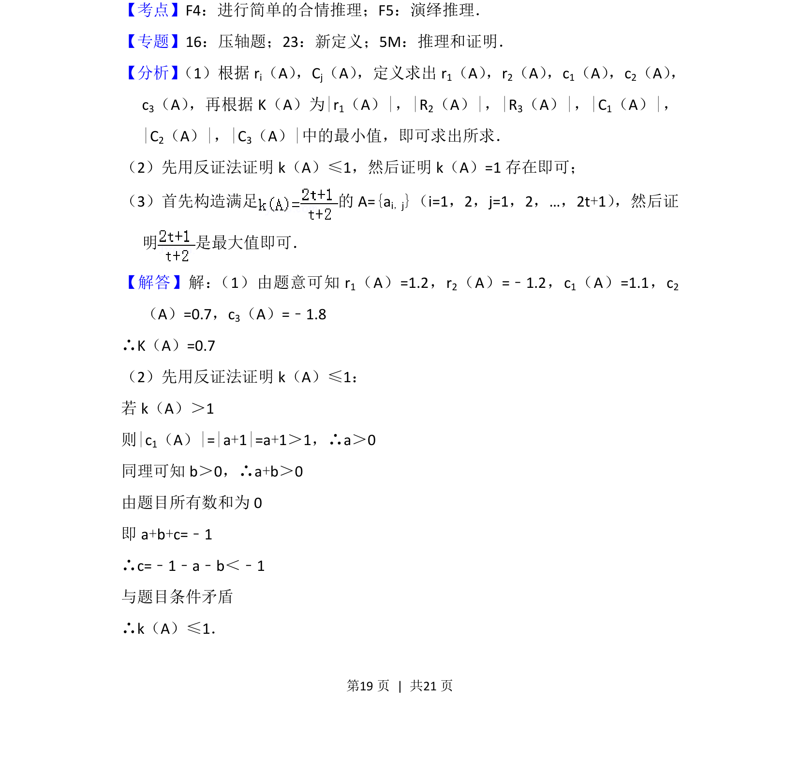
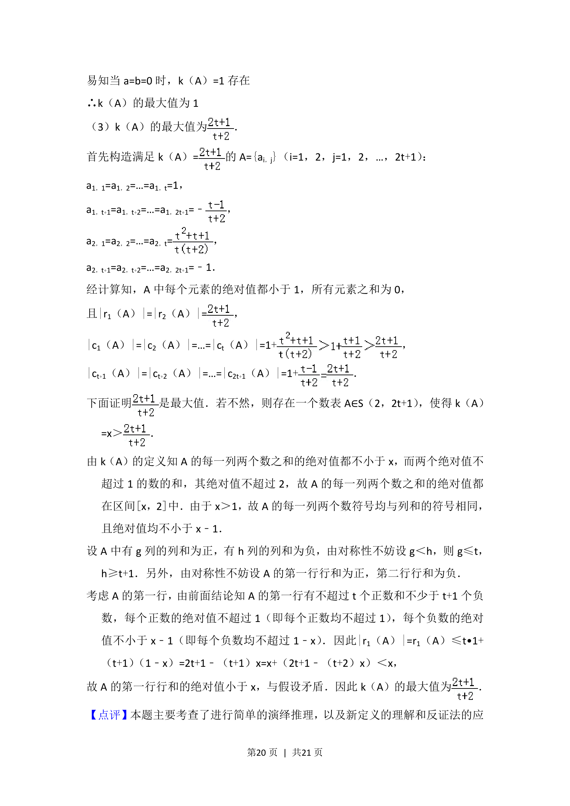
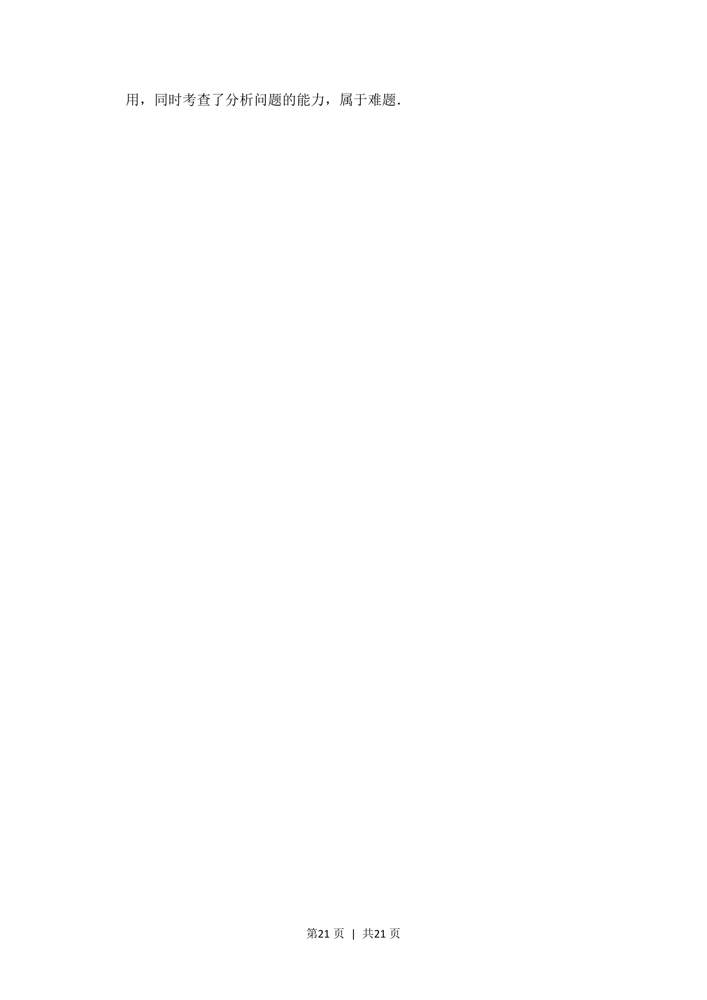

## 题面

## 摘要

本题定义了数表集合及行和、列和绝对值的最小值概念，要求计算给定数表的K值。

## 关联考点

- [[数表与矩阵]]
- [[绝对值最值]]
- [[1386-新定义问题|新定义问题]]

## 答案与解析

> 📄 原 PDF 第 18 页：`素材/真题/北京/2008-2024·（北京）数学高考真题/2012年高考数学试卷（理）（北京）（解析卷）.pdf`

<!-- 题干文本-start -->
## 题干文本
20． （13分）设A是由m×n个实数组成的m行n列的数表，满足：每个数的绝
对值不大于1，且所有数的和为零，记s（m，n）为所有这样的数表构成的集
合．对于A∈S（m，n） ，记ri（A）为A的第ⅰ行各数之和（1≤ⅰ≤m） ，Cj
（A）为A的第j列各数之和（1≤j≤n） ；记K（A）为|r 1（A）|，|R 2（A）
|，…，|Rm（A）|，|C1（A）|，|C2（A）|，…，|Cn（A）|中的最小值．
（1）如表A，求K（A）的值；
<!-- 题干文本-end -->

<!-- 解析文本-start -->
## 解析文本

<!-- 解析文本-end -->
