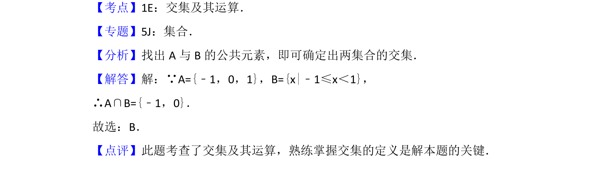

## 题面

## 摘要

已知集合 A 和 B，求它们的交集

## 关联考点

- [[645-交集及其运算|交集及其运算]]
- [[042-集合|集合]]

## 答案与解析

> 📄 原 PDF 第 1 页：`素材/真题/北京/2008-2024·（北京）数学高考真题/2013年高考数学试卷（文）（北京）（解析卷）.pdf`

<!-- 题干文本-start -->
## 题干文本
1． （5分）已知集合A={﹣1，0，1}，B={x|﹣1≤x＜1}，则A∩B=（　　）
A．{0}B．{﹣1，0}C．{0，1}D．{﹣1，0，1}
<!-- 题干文本-end -->

<!-- 解析文本-start -->
## 解析文本
【考点】1E：交集及其运算．菁优网版权所有
【专题】5J：集合．
【分析】找出A与B的公共元素，即可确定出两集合的交集．
【解答】解：∵A={﹣1，0，1}，B={x|﹣1≤x＜1}，
∴A∩B={﹣1，0}．
故选：B．
【点评】此题考查了交集及其运算，熟练掌握交集的定义是解本题的关键．
<!-- 解析文本-end -->
