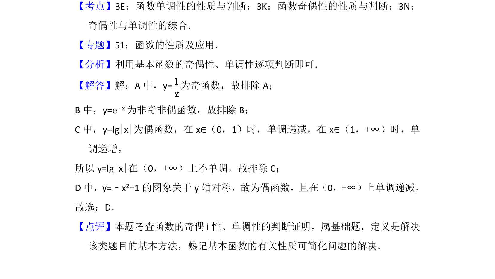

## 题面

## 摘要

考查基本函数的奇偶性和单调性判断，通过排除法选出正确选项。

## 关联考点

- [[679-函数奇偶性|函数奇偶性]]
- [[432-导数与函数单调性|函数单调性]]
- [[奇偶性与单调性综合]]

## 答案与解析

> 📄 原 PDF 第 2 页：`素材/真题/北京/2008-2024·（北京）数学高考真题/2013年高考数学试卷（文）（北京）（解析卷）.pdf`
