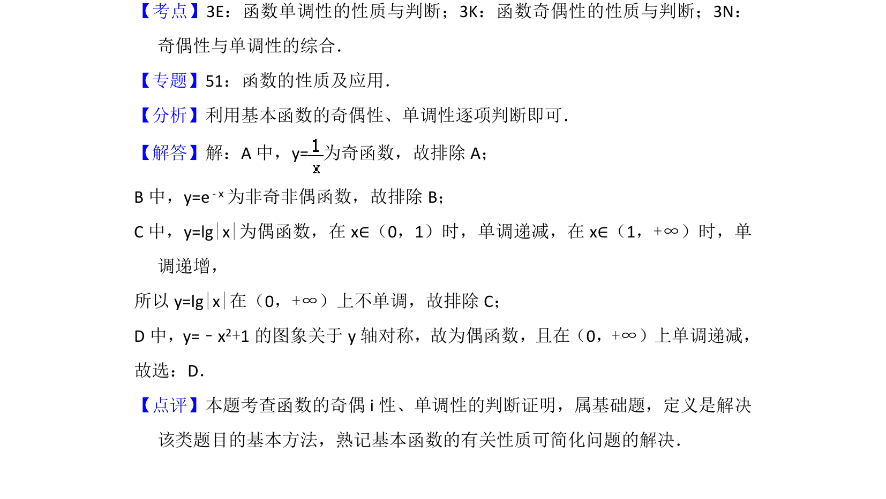

## 题面

## 摘要

考查基本函数的奇偶性和单调性判断，通过排除法选出正确选项。

## 关联考点

- [[284-函数的奇偶性|函数奇偶性]]
- [[432-导数与函数单调性|函数单调性]]
- [[奇偶性与单调性综合]]

## 答案与解析

> 📄 原 PDF 第 2 页：`素材/真题/北京/2008-2024·（北京）数学高考真题/2013年高考数学试卷（文）（北京）（解析卷）.pdf`

<!-- 题干文本-start -->
## 题干文本
3． （5分）下列函数中，既是偶函数又在区间（0，+∞）上单调递减的是（　　）
A．B．y=e ﹣x C．y=lg|x|D．y=﹣x 2+1
<!-- 题干文本-end -->

<!-- 解析文本-start -->
## 解析文本
【考点】3E：函数单调性的性质与判断；3K：函数奇偶性的性质与判断；3N：
奇偶性与单调性的综合．菁优网版权所有
【专题】51：函数的性质及应用．
【分析】利用基本函数的奇偶性、单调性逐项判断即可．
【解答】解：A中，y=为奇函数，故排除A；
B中，y=e ﹣x为非奇非偶函数，故排除B；
C中，y=lg|x|为偶函数，在x∈（0，1）时，单调递减，在x∈（1，+∞）时，单
调递增，
所以y=lg|x|在（0，+∞）上不单调，故排除C；
D中，y=﹣x 2+1的图象关于y轴对称，故为偶函数，且在（0，+∞）上单调递减，
故选：D．
【点评】本题考查函数的奇偶i性、单调性的判断证明，属基础题，定义是解决
该类题目的基本方法，熟记基本函数的有关性质可简化问题的解决．
<!-- 解析文本-end -->
