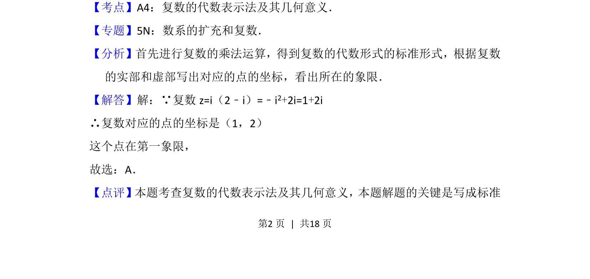

## 题面

## 摘要

考查复数的乘法运算及复平面内点的象限判断。

## 关联考点

- [[1376-复数的代数表示法及其几何意义|复数的代数表示法及其几何意义]]
- [[332-复数的乘除运算|复数乘法]]

## 答案与解析

> 📄 原 PDF 第 2 页：`素材/真题/北京/2008-2024·（北京）数学高考真题/2013年高考数学试卷（文）（北京）（解析卷）.pdf`

<!-- 题干文本-start -->
## 题干文本
4． （5分）在复平面内，复数i（2﹣i）对应的点位于（　　）
A．第一象限B．第二象限C．第三象限D．第四象限
<!-- 题干文本-end -->

<!-- 解析文本-start -->
## 解析文本
【考点】A4：复数的代数表示法及其几何意义．菁优网版权所有
【专题】5N：数系的扩充和复数．
【分析】首先进行复数的乘法运算，得到复数的代数形式的标准形式，根据复数
的实部和虚部写出对应的点的坐标，看出所在的象限．
【解答】解：∵复数z=i（2﹣i）=﹣i 2+2i=1+2i
∴复数对应的点的坐标是（1，2）
这个点在第一象限，
故选：A．
【点评】本题考查复数的代数表示法及其几何意义，本题解题的关键是写成标准
<!-- 解析文本-end -->
