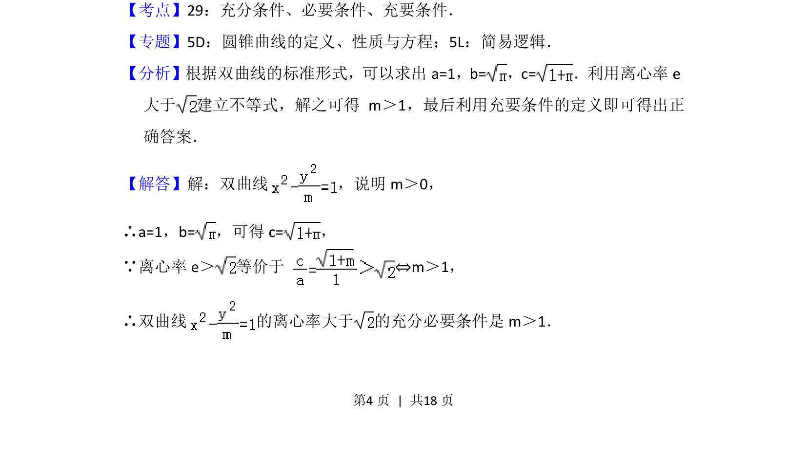
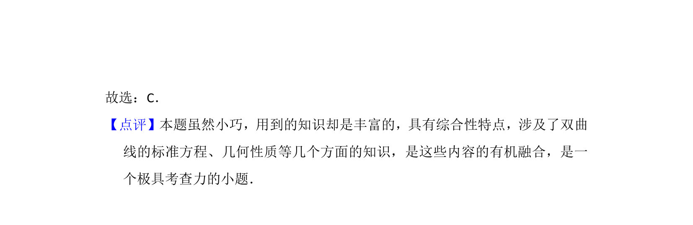

## 题面

## 摘要

本题考查双曲线离心率大于特定值的充分必要条件，涉及双曲线性质与简易逻辑结合。

## 关联考点

- [[1274-双曲线的几何性质|双曲线的几何性质]]
- [[533-充分必要条件|充分必要条件]]
- [[391-椭圆离心率|离心率]]

## 答案与解析

> 📄 原 PDF 第 4 页：`素材/真题/北京/2008-2024·（北京）数学高考真题/2013年高考数学试卷（文）（北京）（解析卷）.pdf`
