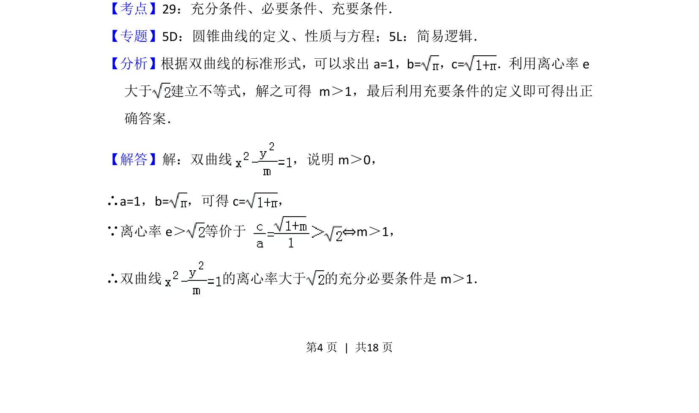
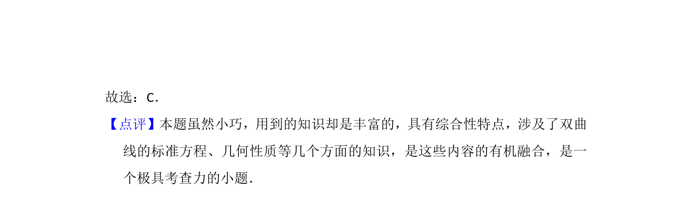

## 题面

## 摘要

本题考查双曲线离心率大于特定值的充分必要条件，涉及双曲线性质与简易逻辑结合。

## 关联考点

- [[367-双曲线几何性质|双曲线的几何性质]]
- [[533-充分必要条件|充分必要条件]]
- [[391-椭圆离心率|离心率]]

## 答案与解析

> 📄 原 PDF 第 4 页：`素材/真题/北京/2008-2024·（北京）数学高考真题/2013年高考数学试卷（文）（北京）（解析卷）.pdf`

<!-- 题干文本-start -->
## 题干文本
7． （5分）双曲线 的离心率大于 的充分必要条件是（　　）
A．B．m≥1 C．m＞1 D．m＞2
<!-- 题干文本-end -->

<!-- 解析文本-start -->
## 解析文本
【考点】29：充分条件、必要条件、充要条件．菁优网版权所有
【专题】5D：圆锥曲线的定义、性质与方程；5L：简易逻辑．
【分析】根据双曲线的标准形式，可以求出a=1，b=，c=．利用离心率e
大于 建立不等式，解之可得 m＞1，最后利用充要条件的定义即可得出正
确答案．
【解答】解：双曲线 ，说明m＞0，
∴a=1，b=，可得c=，
∵离心率e＞ 等价于 ⇔m＞1，
∴双曲线 的离心率大于 的充分必要条件是m＞1．
<!-- 解析文本-end -->
