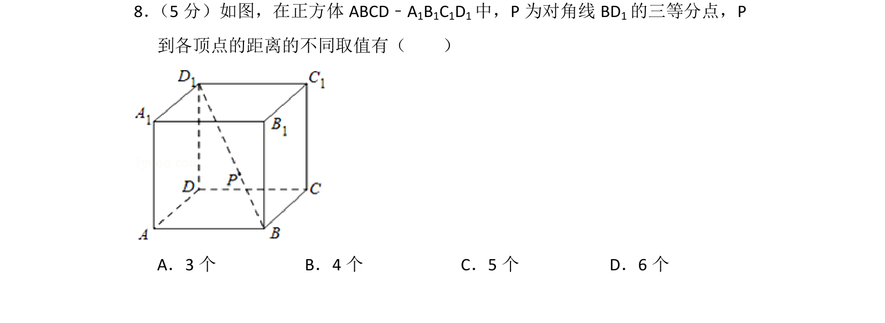
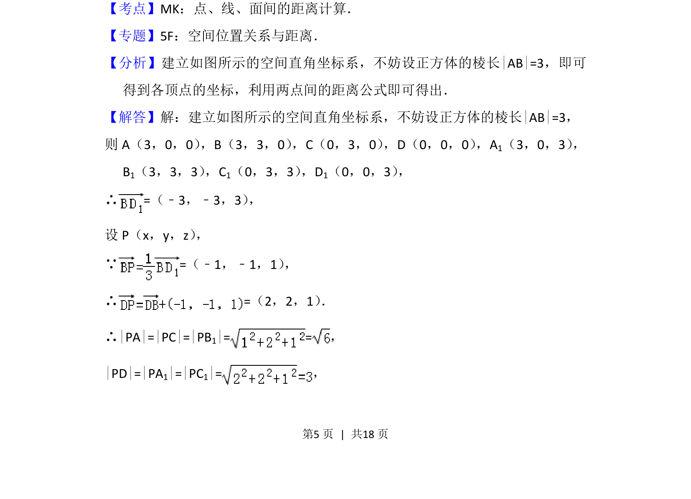
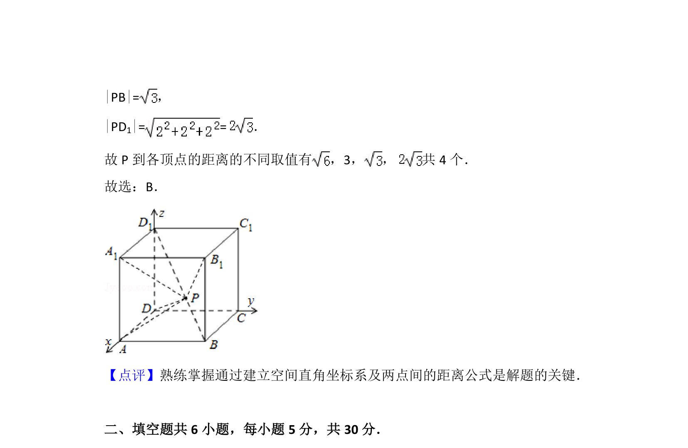

## 题面

## 摘要

求正方体对角线三等分点到各顶点距离的取值个数，用空间直角坐标系计算两点间距离。

## 关联考点

- [[点]]
- [[线]]
- [[面间的距离计算]]
- [[399-空间向量坐标表示|空间直角坐标系]]
- [[626-两点间距离公式|两点间距离公式]]

## 答案与解析

> 📄 原 PDF 第 5 页：`素材/真题/北京/2008-2024·（北京）数学高考真题/2013年高考数学试卷（文）（北京）（解析卷）.pdf`
