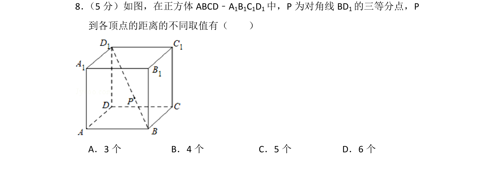
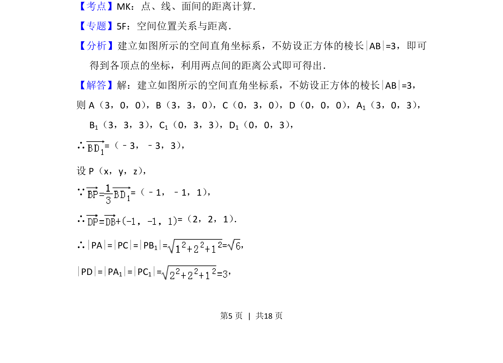
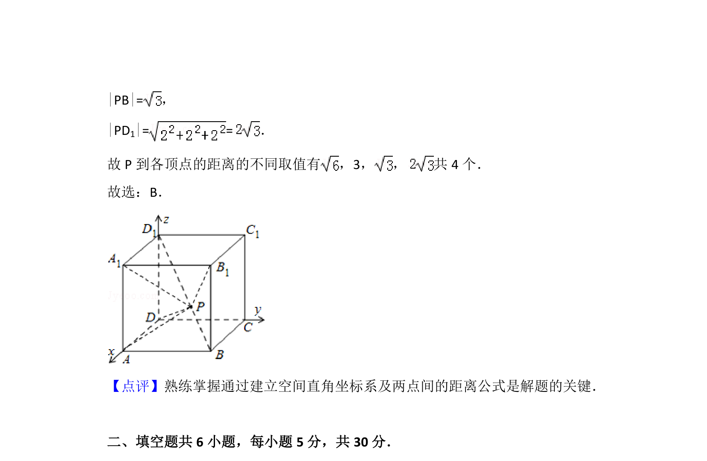

## 题面

## 摘要

求正方体对角线三等分点到各顶点距离的取值个数，用空间直角坐标系计算两点间距离。

## 关联考点

- [[点]]
- [[线]]
- [[面间的距离计算]]
- [[399-空间向量坐标表示|空间直角坐标系]]
- [[626-两点间距离公式|两点间距离公式]]

## 答案与解析

> 📄 原 PDF 第 5 页：`素材/真题/北京/2008-2024·（北京）数学高考真题/2013年高考数学试卷（文）（北京）（解析卷）.pdf`

<!-- 题干文本-start -->
## 题干文本
8． （5分）如图，在正方体ABCD﹣A1B1C1D1中，P为对角线BD 1的三等分点，P
到各顶点的距离的不同取值有（　　）
A．3个B．4个C．5个D．6个
<!-- 题干文本-end -->

<!-- 解析文本-start -->
## 解析文本
【考点】MK：点、线、面间的距离计算．菁优网版权所有
【专题】5F：空间位置关系与距离．
【分析】建立如图所示的空间直角坐标系，不妨设正方体的棱长|AB|=3，即可
得到各顶点的坐标，利用两点间的距离公式即可得出．
【解答】解：建立如图所示的空间直角坐标系，不妨设正方体的棱长|AB|=3，
则A（3，0，0） ，B（3，3，0） ，C（0，3，0） ，D（0，0，0） ，A1（3，0，3） ，
B1（3，3，3） ，C1（0，3，3） ，D1（0，0，3） ，
∴=（﹣3，﹣3，3） ，
设P（x，y，z） ，
∵=（﹣1，﹣1，1） ，
∴=（2，2，1） ．
∴|PA|=|PC|=|PB1|= =，
|PD|=|PA1|=|PC1|=，
<!-- 解析文本-end -->
