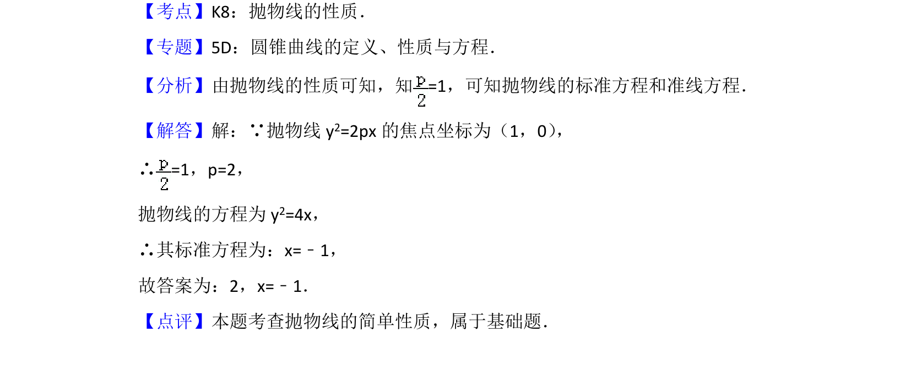

## 题面

## 摘要

由抛物线焦点坐标求参数p和准线方程。

## 关联考点

- [[879-抛物线的性质|抛物线的性质]]
- [[1166-抛物线标准方程|抛物线的标准方程]]
- [[准线方程]]

## 答案与解析

> 📄 原 PDF 第 6 页：`素材/真题/北京/2008-2024·（北京）数学高考真题/2013年高考数学试卷（文）（北京）（解析卷）.pdf`

<!-- 题干文本-start -->
## 题干文本
9． （5分）若抛物线y2=2px的焦点坐标为（1，0） ，则p=　2　；准线方程为　
x=﹣1　．
<!-- 题干文本-end -->

<!-- 解析文本-start -->
## 解析文本
【考点】K8：抛物线的性质．菁优网版权所有
【专题】5D：圆锥曲线的定义、性质与方程．
【分析】由抛物线的性质可知，知=1，可知抛物线的标准方程和准线方程．
【解答】解：∵抛物线y 2=2px的焦点坐标为（1，0） ，
∴=1，p=2，
抛物线的方程为y 2=4x，
∴其标准方程为：x=﹣1，
故答案为：2，x=﹣1．
【点评】本题考查抛物线的简单性质，属于基础题．
<!-- 解析文本-end -->
