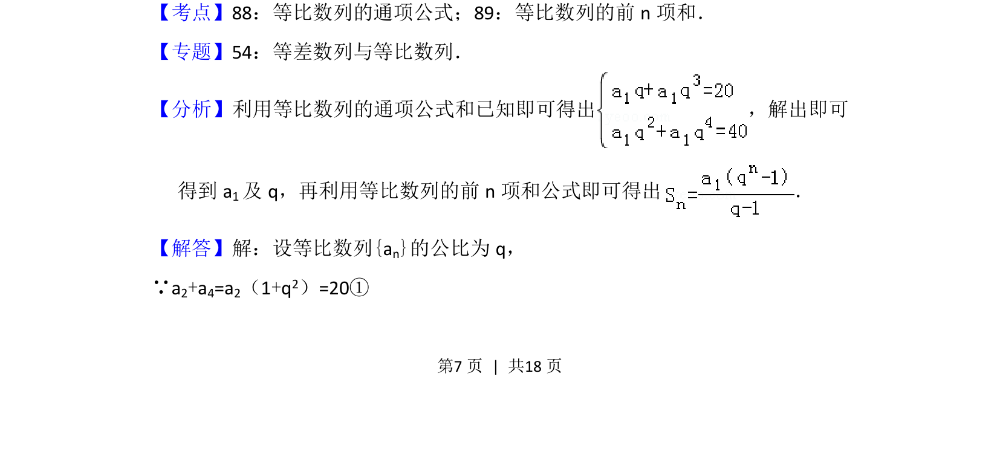
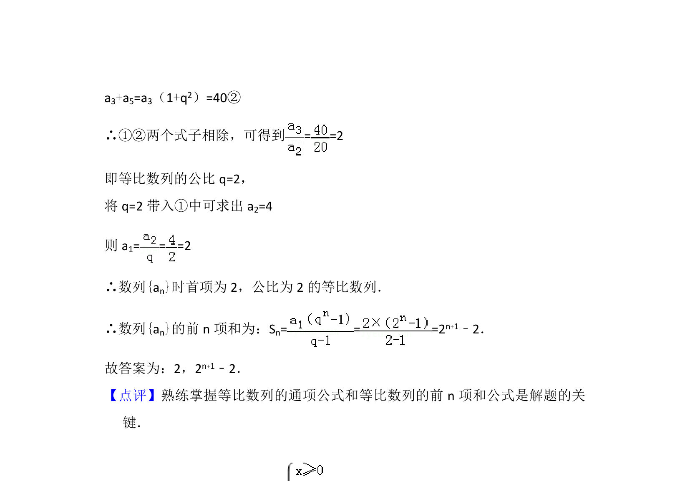

## 题面

## 摘要

等比数列已知两项和求公比与前n项和。

## 关联考点

- [[1070-等比数列通项公式|等比数列的通项公式]]
- [[1392-等比数列的前n项和公式|等比数列的前n项和公式]]

## 答案与解析

> 📄 原 PDF 第 7 页：`素材/真题/北京/2008-2024·（北京）数学高考真题/2013年高考数学试卷（文）（北京）（解析卷）.pdf`

<!-- 题干文本-start -->
## 题干文本
11． （5分）若等比数列{an}满足a 2+a4=20，a3+a5=40，则公比q=　2　；前n项
和S n=　2n+1﹣2　．
<!-- 题干文本-end -->

<!-- 解析文本-start -->
## 解析文本
【考点】88：等比数列的通项公式；89：等比数列的前n项和．菁优网版权所有
【专题】54：等差数列与等比数列．
【分析】利用等比数列的通项公式和已知即可得出 ，解出即可
得到a 1及q，再利用等比数列的前n项和公式即可得出 ．
【解答】解：设等比数列{an}的公比为q，
∵a2+a4=a2（1+q2）=20①
<!-- 解析文本-end -->
