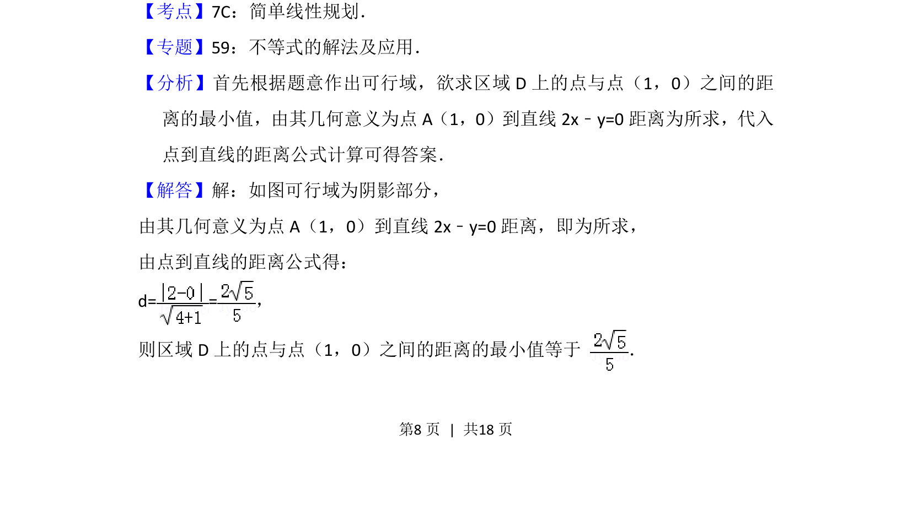
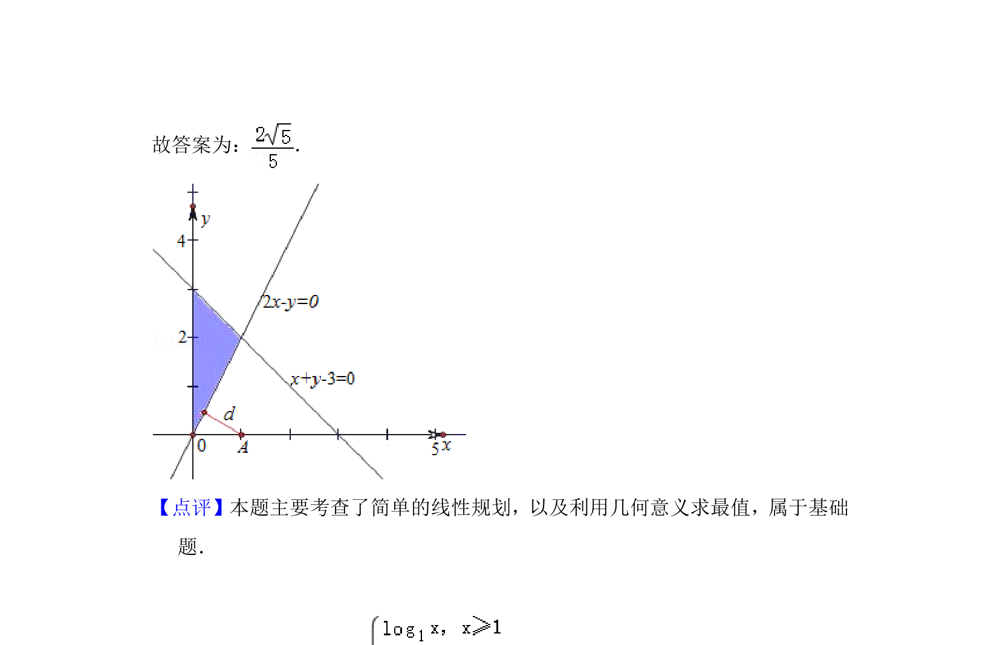

## 题面

## 摘要

考查线性规划可行域内点到定点距离的最小值，利用点到直线距离公式求解。

## 关联考点

- [[1075-简单线性规划|简单线性规划]]
- [[570-点到直线的距离公式|点到直线的距离公式]]

## 答案与解析

> 📄 原 PDF 第 8 页：`素材/真题/北京/2008-2024·（北京）数学高考真题/2013年高考数学试卷（文）（北京）（解析卷）.pdf`
