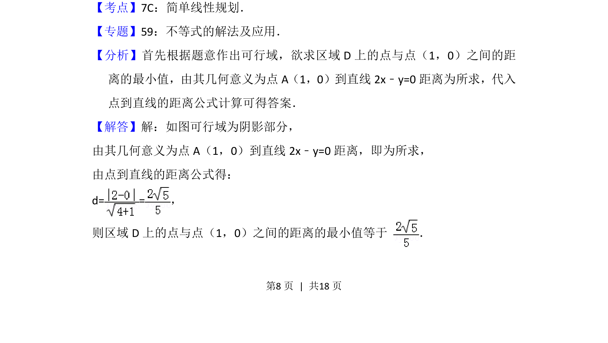
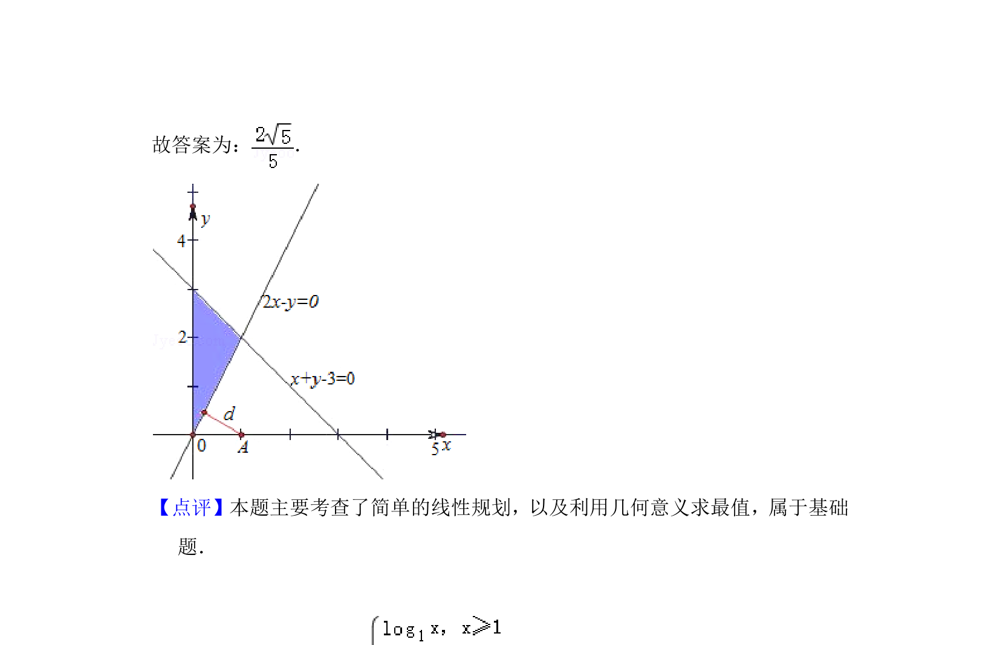

## 题面

## 摘要

考查线性规划可行域内点到定点距离的最小值，利用点到直线距离公式求解。

## 关联考点

- [[1074-简单线性规划|简单线性规划]]
- [[570-点到直线的距离公式|点到直线的距离公式]]

## 答案与解析

> 📄 原 PDF 第 8 页：`素材/真题/北京/2008-2024·（北京）数学高考真题/2013年高考数学试卷（文）（北京）（解析卷）.pdf`

<!-- 题干文本-start -->
## 题干文本
12． （5分）设D为不等式组 表示的平面区域，区域D上的点与点
（1，0）之间的距离的最小值为　 　．
<!-- 题干文本-end -->

<!-- 解析文本-start -->
## 解析文本
【考点】7C：简单线性规划．菁优网版权所有
【专题】59：不等式的解法及应用．
【分析】首先根据题意作出可行域，欲求区域D上的点与点（1，0）之间的距
离的最小值，由其几何意义为点A（1，0）到直线2x﹣y=0距离为所求，代入
点到直线的距离公式计算可得答案．
【解答】解：如图可行域为阴影部分，
由其几何意义为点A（1，0）到直线2x﹣y=0距离，即为所求，
由点到直线的距离公式得：
d= =，
则区域D上的点与点（1，0）之间的距离的最小值等于 ．
<!-- 解析文本-end -->
