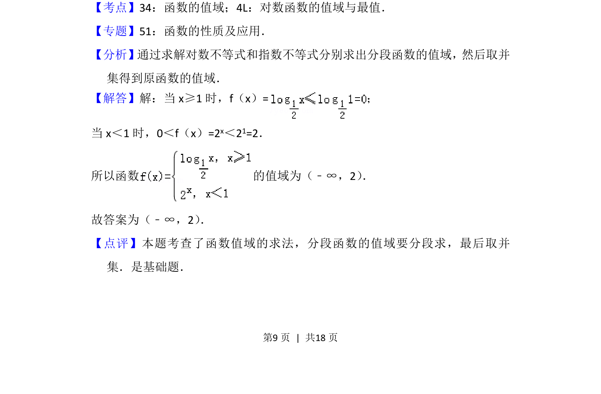

## 题面

## 摘要

分段函数值域求解，结合对数与指数函数性质，需分段求值域后取并集。

## 关联考点

- [[686-函数的值域|函数的值域]]
- [[对数函数的值域与最值]]
- [[290-分段函数|分段函数]]

## 答案与解析

> 📄 原 PDF 第 9 页：`素材/真题/北京/2008-2024·（北京）数学高考真题/2013年高考数学试卷（文）（北京）（解析卷）.pdf`
