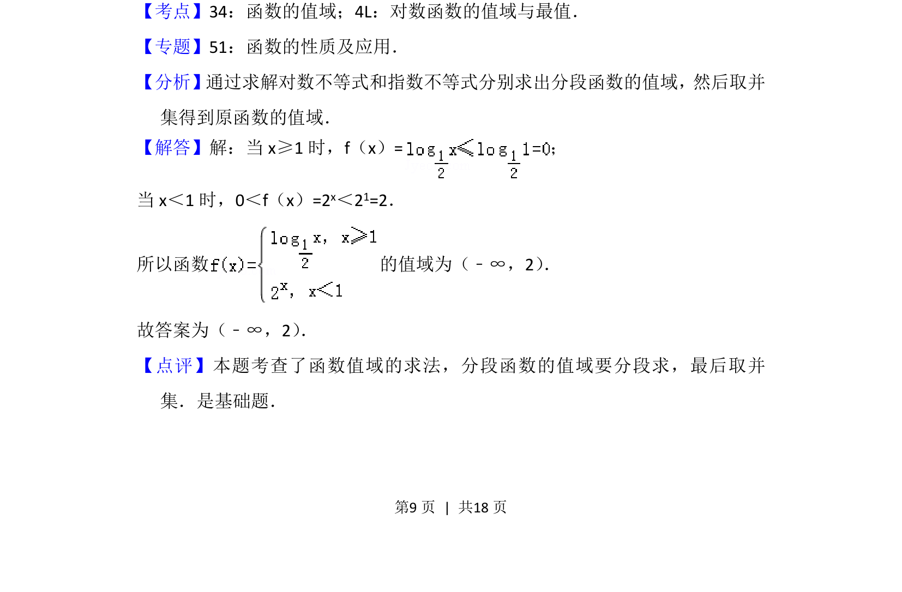

## 题面

## 摘要

分段函数值域求解，结合对数与指数函数性质，需分段求值域后取并集。

## 关联考点

- [[676-函数值域|函数的值域]]
- [[对数函数的值域与最值]]
- [[290-分段函数|分段函数]]

## 答案与解析

> 📄 原 PDF 第 9 页：`素材/真题/北京/2008-2024·（北京）数学高考真题/2013年高考数学试卷（文）（北京）（解析卷）.pdf`

<!-- 题干文本-start -->
## 题干文本
13． （5分）函数f（x）=的值域为　（﹣∞，2）　．
<!-- 题干文本-end -->

<!-- 解析文本-start -->
## 解析文本
【考点】34：函数的值域；4L：对数函数的值域与最值．菁优网版权所有
【专题】51：函数的性质及应用．
【分析】通过求解对数不等式和指数不等式分别求出分段函数的值域，然后取并
集得到原函数的值域．
【解答】解：当x≥1时，f（x）=；
当x＜1时，0＜f（x）=2 x＜21=2．
所以函数 的值域为（﹣∞，2） ．
故答案为（﹣∞，2） ．
【点评】本题考查了函数值域的求法，分段函数的值域要分段求，最后取并
集．是基础题．
<!-- 解析文本-end -->
