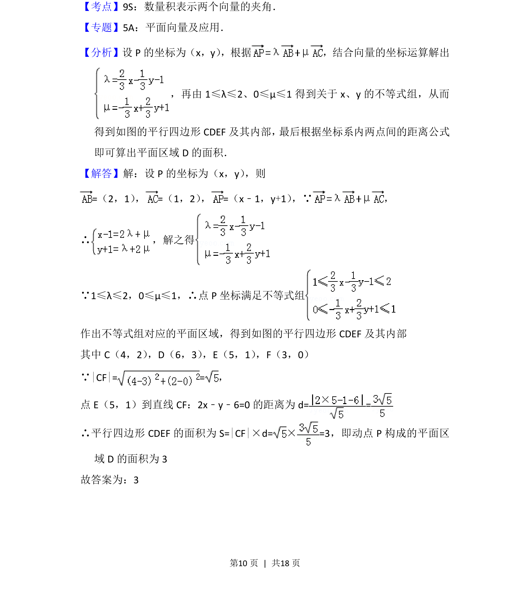
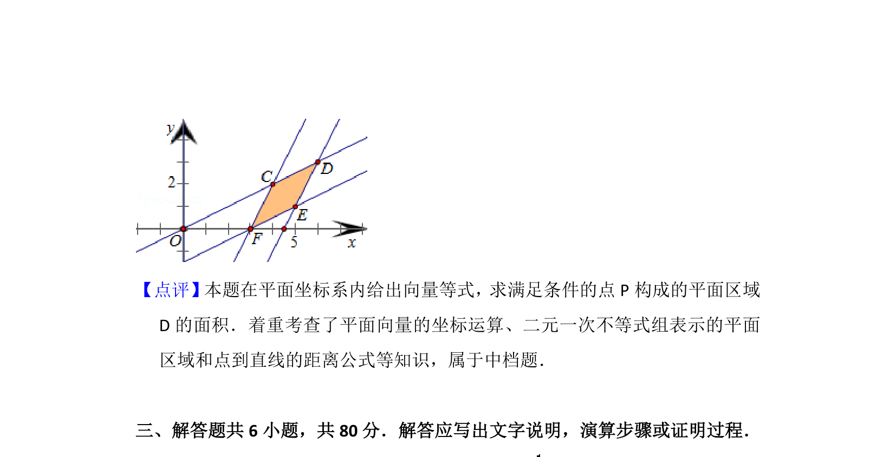

## 题面

## 摘要

该题通过向量线性组合条件构建动点坐标的不等式组，转化为平面区域并计算平行四边形面积。

## 关联考点

- [[335-平面向量坐标运算|平面向量坐标运算]]
- [[1074-简单线性规划|线性规划]]
- [[392-点到直线距离公式|点到直线距离公式]]
- [[062-多边形面积|平行四边形面积]]

## 答案与解析

> 📄 原 PDF 第 10 页：`素材/真题/北京/2008-2024·（北京）数学高考真题/2013年高考数学试卷（文）（北京）（解析卷）.pdf`
