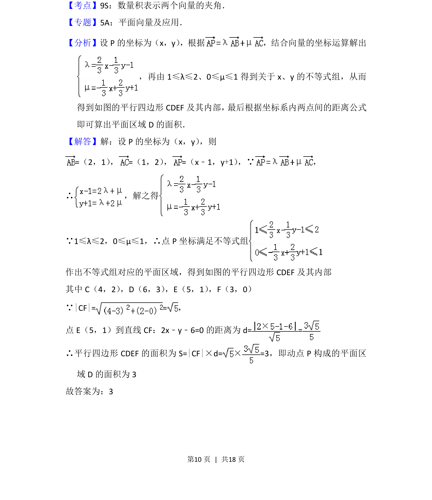
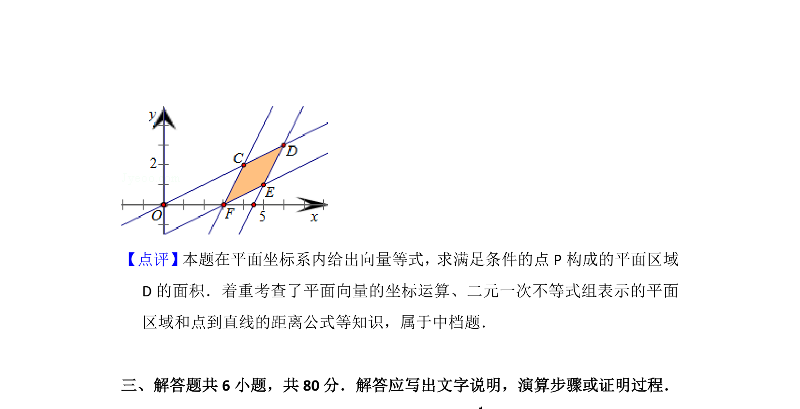

## 题面

## 摘要

该题通过向量线性组合条件构建动点坐标的不等式组，转化为平面区域并计算平行四边形面积。

## 关联考点

- [[335-平面向量坐标运算|平面向量坐标运算]]
- [[1074-简单线性规划|线性规划]]
- [[570-点到直线的距离公式|点到直线距离公式]]
- [[062-多边形面积|平行四边形面积]]

## 答案与解析

> 📄 原 PDF 第 10 页：`素材/真题/北京/2008-2024·（北京）数学高考真题/2013年高考数学试卷（文）（北京）（解析卷）.pdf`

<!-- 题干文本-start -->
## 题干文本
14． （5分）已知点A（1，﹣1） ，B（3，0） ，C（2，1） ．若平面区域D由所有满
足 （1≤λ≤2，0≤μ≤1）的点P组成，则D的面积为　3　．
<!-- 题干文本-end -->

<!-- 解析文本-start -->
## 解析文本
【考点】9S：数量积表示两个向量的夹角．菁优网版权所有
【专题】5A：平面向量及应用．
【分析】设P的坐标为（x，y） ，根据 ，结合向量的坐标运算解出
，再由1≤λ≤2、0≤μ≤1得到关于x、y的不等式组，从而
得到如图的平行四边形CDEF及其内部， 最后根据坐标系内两点间的距离公式
即可算出平面区域D的面积．
【解答】解：设P的坐标为（x，y） ，则
=（2，1） ，=（1，2） ，=（x﹣1，y+1） ，∵ ，
∴ ，解之得
∵1≤λ≤2，0≤μ≤1，∴点P坐标满足不等式组
作出不等式组对应的平面区域，得到如图的平行四边形CDEF及其内部
其中C（4，2） ，D（6，3） ，E（5，1） ，F（3，0）
∵|CF|= =，
点E（5，1）到直线CF：2x﹣y﹣6=0的距离为d= =
∴平行四边形CDEF的面积为S=|CF|×d=×=3，即动点P构成的平面区
域D的面积为3
故答案为：3
<!-- 解析文本-end -->
