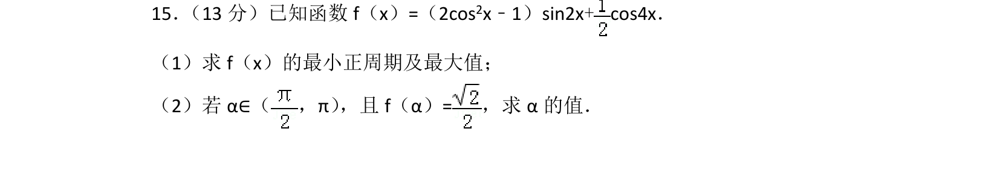
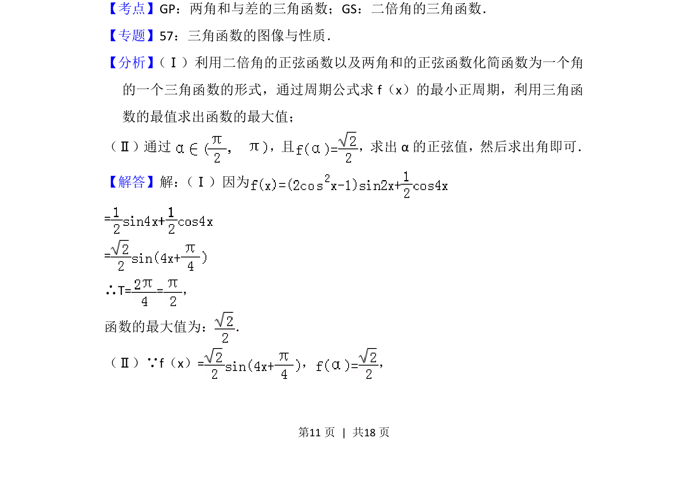
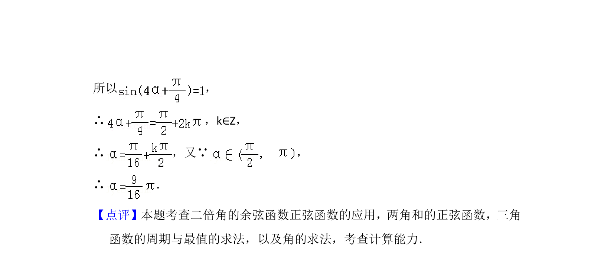

## 题面

## 摘要

已知函数包含二倍角与和差角化简，求最小正周期、最大值，并由函数值求角

## 关联考点

- [[638-二倍角的三角函数|二倍角的三角函数]]
- [[628-两角和与差的三角函数|两角和与差的三角函数]]
- [[611-三角函数的周期性|三角函数的周期性]]

## 答案与解析

> 📄 原 PDF 第 11 页：`素材/真题/北京/2008-2024·（北京）数学高考真题/2013年高考数学试卷（文）（北京）（解析卷）.pdf`
