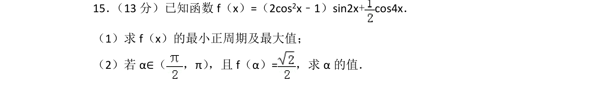
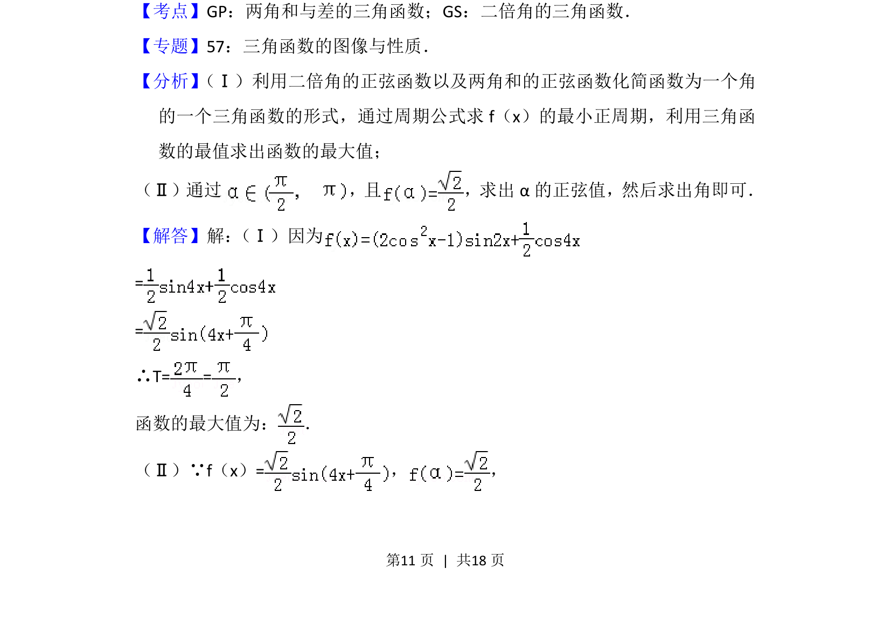
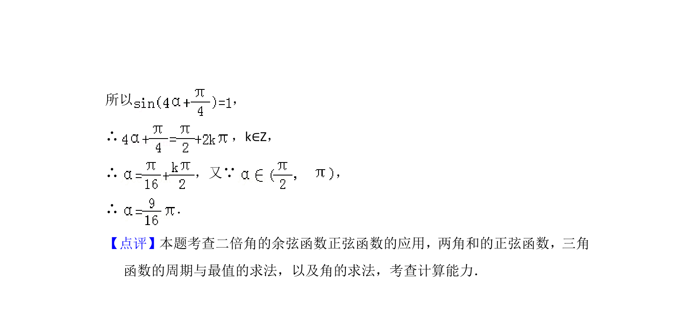

## 题面

## 摘要

已知函数包含二倍角与和差角化简，求最小正周期、最大值，并由函数值求角

## 关联考点

- [[638-二倍角的三角函数|二倍角的三角函数]]
- [[628-两角和与差的三角函数|两角和与差的三角函数]]
- [[611-三角函数的周期性|三角函数的周期性]]

## 答案与解析

> 📄 原 PDF 第 11 页：`素材/真题/北京/2008-2024·（北京）数学高考真题/2013年高考数学试卷（文）（北京）（解析卷）.pdf`

<!-- 题干文本-start -->
## 题干文本
15． （13分）已知函数f（x）=（2cos2x﹣1）sin2x+cos4x．
（1）求f（x）的最小正周期及最大值；
（2）若α∈（ ，π） ，且f（α）=，求α的值．
<!-- 题干文本-end -->

<!-- 解析文本-start -->
## 解析文本
【考点】GP：两角和与差的三角函数；GS：二倍角的三角函数．菁优网版权所有
【专题】57：三角函数的图像与性质．
【分析】 （Ⅰ）利用二倍角的正弦函数以及两角和的正弦函数化简函数为一个角
的一个三角函数的形式，通过周期公式求f（x）的最小正周期，利用三角函
数的最值求出函数的最大值；
（Ⅱ）通过 ，且 ，求出α的正弦值，然后求出角即可．
【解答】解： （Ⅰ）因为
=
=
∴T= =，
函数的最大值为： ．
（Ⅱ）∵f（x）=， ，
<!-- 解析文本-end -->
