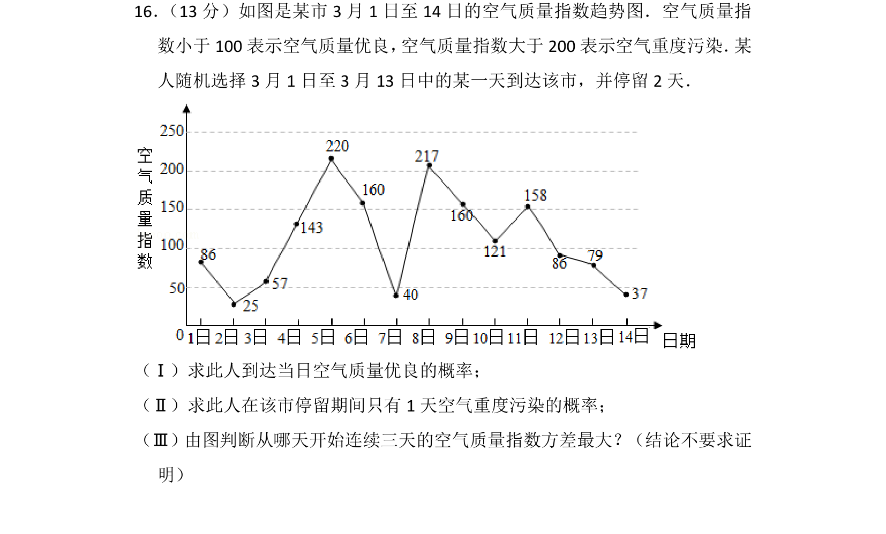
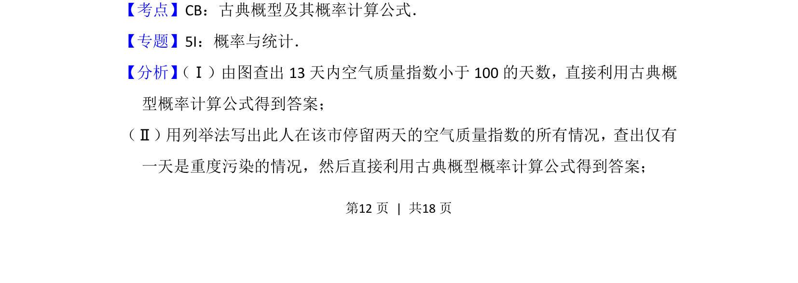
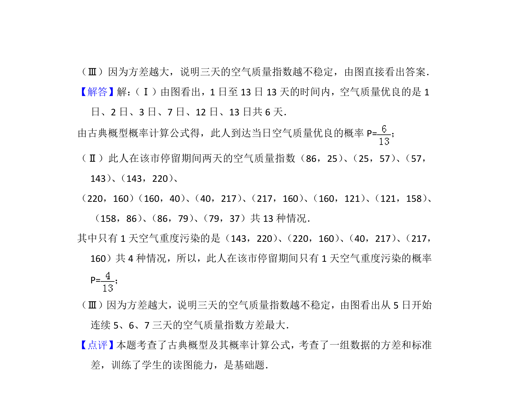

## 题面

## 摘要

此人到达当日空气质量优良的概率计算，停留期间只有1天重度污染的概率，以及连续三天方差最大起始日判断。

## 关联考点

- [[320-古典概型|古典概型]]
- [[948-概率计算|概率计算]]
- [[198-方差|方差]]
- [[应用统计]]

## 答案与解析

> 📄 原 PDF 第 12 页：`素材/真题/北京/2008-2024·（北京）数学高考真题/2013年高考数学试卷（文）（北京）（解析卷）.pdf`
