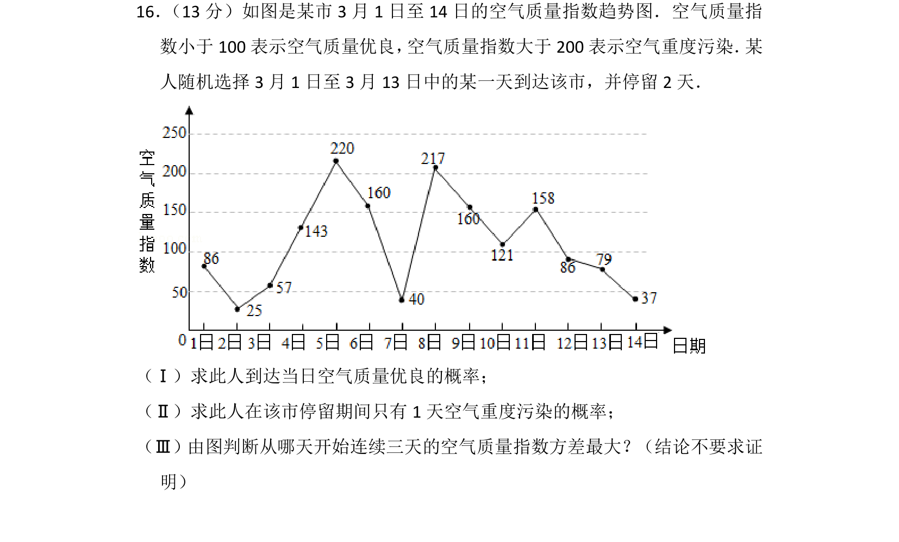
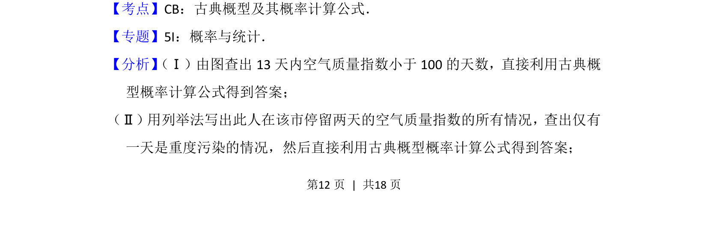
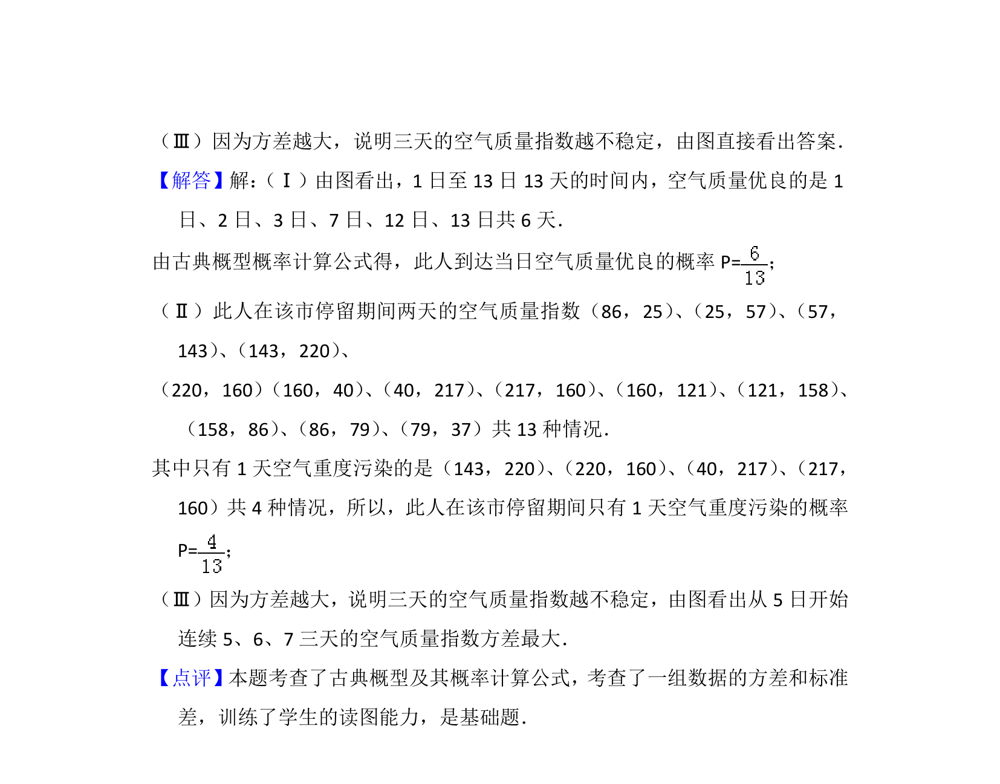

## 题面

## 摘要

此人到达当日空气质量优良的概率计算，停留期间只有1天重度污染的概率，以及连续三天方差最大起始日判断。

## 关联考点

- [[320-古典概型|古典概型]]
- [[948-概率计算|概率计算]]
- [[198-方差|方差]]
- [[应用统计]]

## 答案与解析

> 📄 原 PDF 第 12 页：`素材/真题/北京/2008-2024·（北京）数学高考真题/2013年高考数学试卷（文）（北京）（解析卷）.pdf`

<!-- 题干文本-start -->
## 题干文本
16． （13分）如图是某市3月1日至14日的空气质量指数趋势图．空气质量指
数小于100表示空气质量优良， 空气质量指数大于200表示空气重度污染． 某
人随机选择3月1日至3月13日中的某一天到达该市，并停留2天．
（Ⅰ）求此人到达当日空气质量优良的概率；
（Ⅱ）求此人在该市停留期间只有1天空气重度污染的概率；
（Ⅲ）由图判断从哪天开始连续三天的空气质量指数方差最大？（结论不要求证
明）
<!-- 题干文本-end -->

<!-- 解析文本-start -->
## 解析文本
【考点】CB：古典概型及其概率计算公式．菁优网版权所有
【专题】5I：概率与统计．
【分析】 （Ⅰ）由图查出13天内空气质量指数小于100的天数，直接利用古典概
型概率计算公式得到答案；
（Ⅱ）用列举法写出此人在该市停留两天的空气质量指数的所有情况，查出仅有
一天是重度污染的情况，然后直接利用古典概型概率计算公式得到答案；
<!-- 解析文本-end -->
