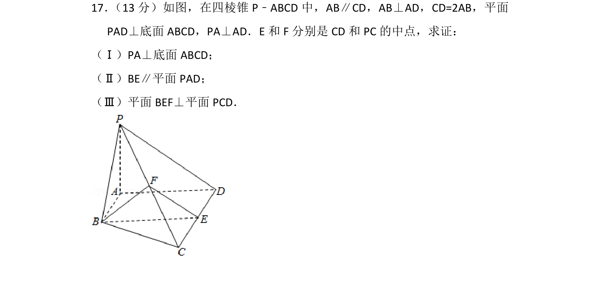
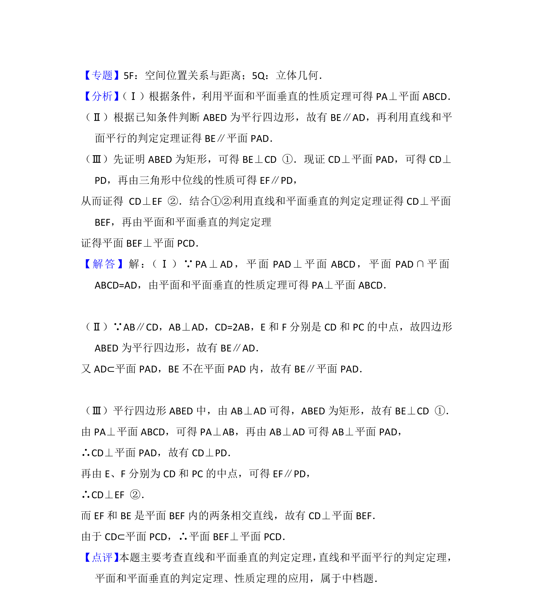

## 题面

## 摘要

四棱锥中证明线面垂直、线面平行和面面垂直关系

## 关联考点

- [[1011-直线与平面平行|直线与平面平行]]
- [[1010-直线与平面垂直|直线与平面垂直]]
- [[1397-平面与平面垂直|平面与平面垂直]]

## 答案与解析

> 📄 原 PDF 第 13 页：`素材/真题/北京/2008-2024·（北京）数学高考真题/2013年高考数学试卷（文）（北京）（解析卷）.pdf`
