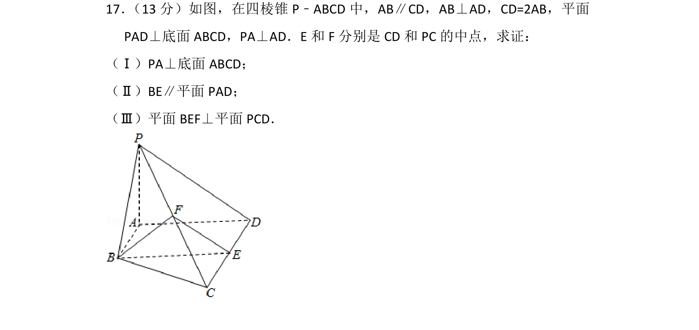
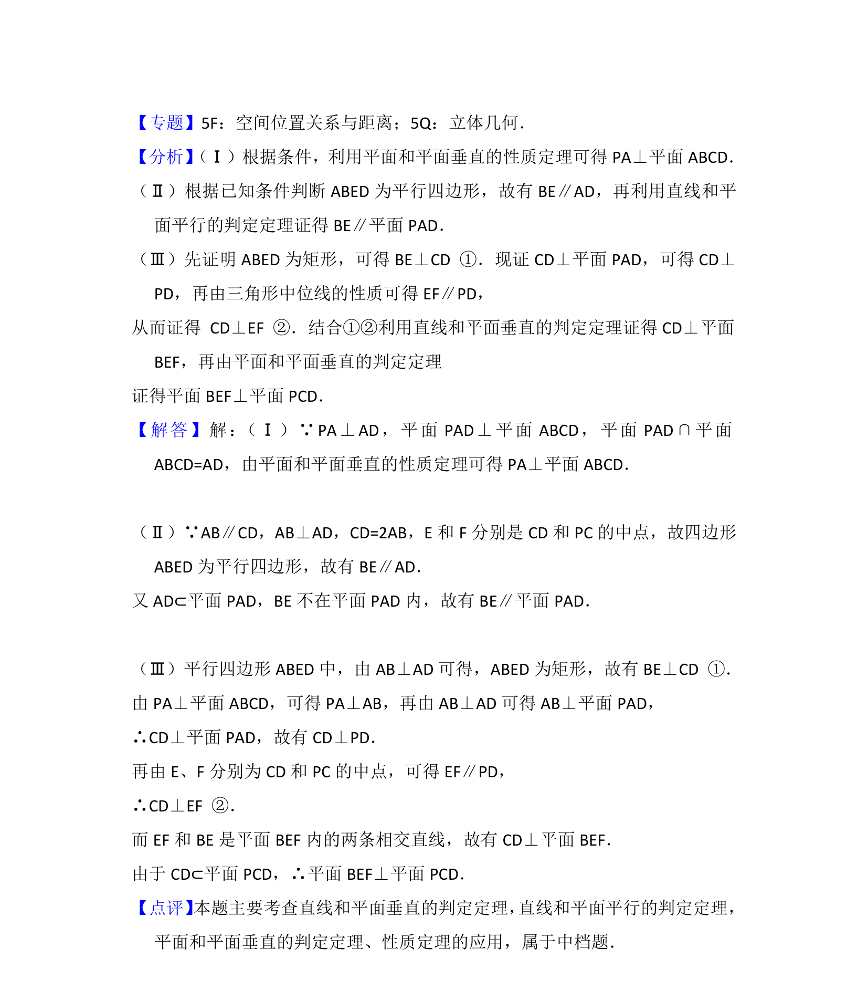

## 题面

## 摘要

四棱锥中证明线面垂直、线面平行和面面垂直关系

## 关联考点

- [[1011-直线与平面平行|直线与平面平行]]
- [[1010-直线与平面垂直|直线与平面垂直]]
- [[1397-平面与平面垂直|平面与平面垂直]]

## 答案与解析

> 📄 原 PDF 第 13 页：`素材/真题/北京/2008-2024·（北京）数学高考真题/2013年高考数学试卷（文）（北京）（解析卷）.pdf`

<!-- 题干文本-start -->
## 题干文本
17． （13分）如图，在四棱锥P﹣ABCD中，AB∥CD，AB⊥AD，CD=2AB，平面
PAD⊥底面ABCD，PA⊥AD．E和F分别是CD和PC的中点，求证：
（Ⅰ）PA⊥底面ABCD；
（Ⅱ）BE∥平面PAD；
（Ⅲ）平面BEF⊥平面PCD．
<!-- 题干文本-end -->

<!-- 解析文本-start -->
## 解析文本
【考点】LS：直线与平面平行；LW：直线与平面垂直；LY：平面与平面垂直．菁优网版权所有
<!-- 解析文本-end -->
